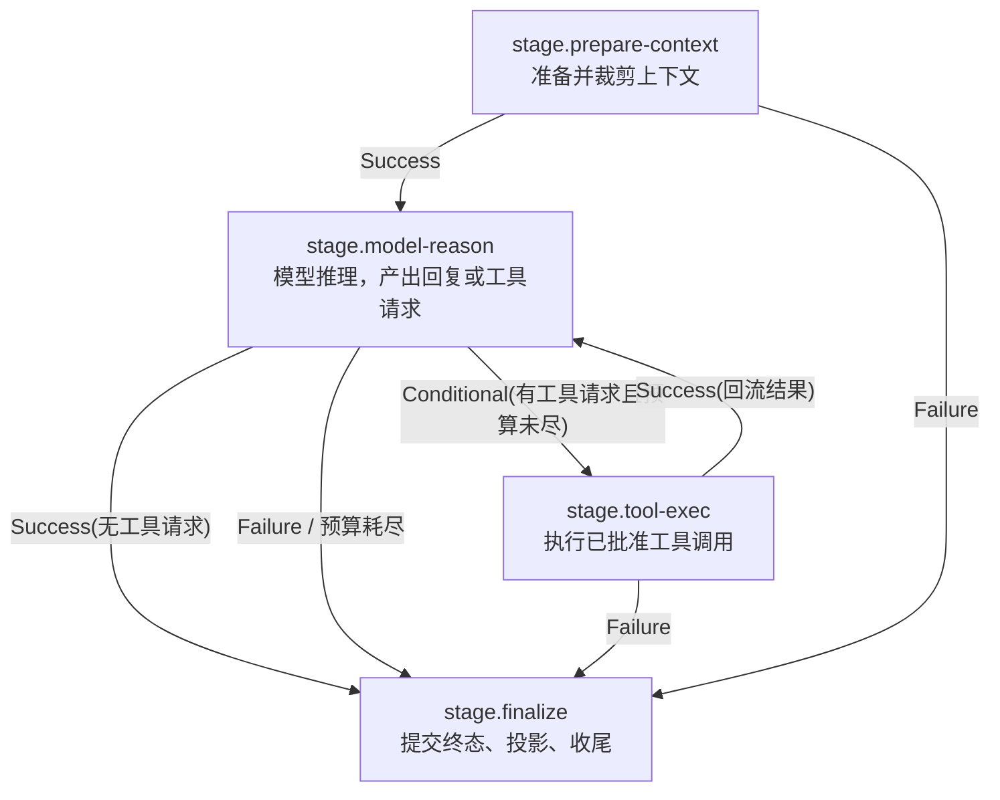

# TianShu 内置固定 StageGraph 设计

## 1. 文档定位

本文定义 TianShu 当前阶段要落地的**内置固定 StageGraph 实施基线**，作为 `Turn` 类核心意图的默认编排基线。

它落地以下已确认的方向决定：

- 自适应 / 自演化（AI 自行生成或晋升 StageGraph）当前**不启用**，归档为"未来在真实执行基线成熟后再探讨"，原因是"无法测量"而非"已被证伪"。
- 本阶段用一套**规定好的固定 Stage**替代单 stage `core_loop` shell；固定图资产、StageGraph 校验、StageGraphInterpreter 的 RuntimeStep 映射和受控反应式 Runtime 执行入口必须保持同一条链路，不得再把单 stage `core_loop` 作为默认 Turn 编排基线。
- 本设计只使用 `src/Contracts/TianShu.Contracts.Kernel` 中**已存在**的 `StageGraph` / `StageNode` / `StageEdge` 契约和 `src/Contracts/TianShu.Contracts.Execution` 的 `RuntimeStep` 家族，不新增 IR 结构。

本文不替代 `docs/tianshu-architecture-spec.md` 与 `docs/architecture/tianshu-kernel-core-loop-design.md`；它是这两份基线在"固定编排"层的具体实例。

### 1.1 当前实现边界

截至 25.8 完成时，当前代码已经完成：

- `CoreIntentKind.Turn` 默认选择内置固定图 `graph.turn.default`，不再选择单 stage `core_loop`。
- `StageGraphInterpreter.InterpretAsync` 能把四个固定 stage 映射为 typed `RuntimeStep` 骨架。
- `StableKernelCore.RunAsync` 能完成 graph validation、静态 `ExecutionPlan` 生成和 `ValidateRuntimeStep` 审查。
- 组合层能把该静态 plan 交给 `IExecutionRuntime.ExecuteAsync` 并取得 runtime result。
- `StableKernelCore.RunAsync` 会在 approved result 中携带已验证 `StageGraph`，供组合层反应式执行使用；RuntimeComposition 不重新构造默认图。
- `AdaptiveRuntimeExecutionLoop.RunReactiveAsync` 能按当前 Stage 过滤 approved `ExecutionPlan`，逐 stage 调用 `IExecutionRuntime.ExecuteAsync`，把 `RuntimeStepResult` 投影为 `StageResult`，再调用 `IStageGraphInterpreter.DecideNextStageAsync` 决定下一跳。
- fake 机制验收已覆盖无工具、有一轮工具、预算耗尽三类路径，证明 `StageResult -> DecideNextStageAsync -> StageEdge` 链路已接通。
- `model-reason` 输出的 `toolRequests[]` 已由 RuntimeComposition 解析并物化为 0..N 个真实 `ToolInvocationStep`；非法、缺失或越权请求按 fail-closed 处理，不再退回静态 allow-list 占位。
- `tool-exec` 输出的 `toolResults[]` 已能回流到下一轮 `model-reason` 的 `ToolResultProviderInputItem`，并保留 `callId / toolId / status / output / failure` 证据。
- `ExecutionRuntimeProviderBridge` 已能把 registered provider 的 `ProviderToolDirectiveEvent` 投影为 `toolRequests[]`，把 completion 投影为最终回复信号，并在 `model-reason` 内执行 30 秒 / 最多 5 次 provider retry。
- `ExecutionRuntimeToolBridge` 已能把 registered tool 的 `ToolInvocationResult` 投影为 `toolResults[]`，供 RuntimeComposition 作为下一轮 provider 输入证据。
- bridge 验收已覆盖 registered local provider/tool 路径：`prepare-context -> model-reason -> tool-exec -> model-reason -> finalize`，其中工具调用来自 provider tool directive，不来自静态骨架占位。
- provider/tool bridge 成功输出已携带 `runtimePlanId / stepId / stepKind / sourceIntentId / sourceGraphId / sourceStageId / sourceKernelOperationId`，`KernelRuntimeReplayProjector` 能按实际 runtime result 重建反应式 run 的 graph / stage / step / model call / tool call / result / metrics 关系。
- `CoreIntentKind.Interrupt` 默认选择 `graph.interrupt.default`，经 `interrupt-host` stage 物化为 `HostInteractionStep(interrupt.cancel_tail_stream)`，不再落回单 stage `core_loop`。
- `CoreIntentKind.Resume` 默认选择 `graph.resume.default`，经 `resume-host` stage 物化为 `HostInteractionStep(resume.from_checkpoint)`，并要求 `ResumeIntent` 在进入 Kernel 前携带非空 `resumeToken` 与 `checkpointRef`。
- CLI `send` 默认路径已进入新 Kernel→Runtime loop；36 起显式旧 AppHost turn 入口已移除，旧实现只作为历史迁移参考，不再作为可触发产品路径。
- 25.3 外部 live 验收只证明显式 openai-compatible Chat Completions 配置能通过当前 `kernel-runtime-loop` 完成一次 live turn；它不证明用户默认配置就绪，也不证明旧/新产品行为完整 parity。
- 25.8 已提供本地核心架构验证入口 `tools/Run-TianShuCoreArchitectureChecks.ps1`，用于串行跑当前源码的 runtime loop、CLI 新路径/parity gate、HostGateway projection、descriptor、文档术语和依赖边界守护。

当前代码**尚未完成**：

- 旧/新产品行为 parity 已作为删除旧入口前的历史迁移证据关闭；36 起不再用旧 AppHost 显式入口作为新增验收基线。
- 新 Kernel→Runtime loop 在 working directory 下已写入最小 turn log / rollout JSONL 证据引用；Host control store 已具备 file-backed active-run cancellation、checkpoint resume、pending steer queue，并已有 CLI `follow-up --kernel-runtime-loop` 产品命令层 interrupt / steer / resume 集成证据。这些证明新路径具备可审计证据通道和 CLI typed Host control 能力；不代表 provider WebSocket parity、非 CLI 宿主控制面 parity 或旧 AppHost 兼容路径完全删除。
- provider WebSocket、旧 transport retry/idle timeout/W3C trace 的完整 parity 仍需后续专项补验；本阶段不使用旧 AppHost turn loop 作为新固定图通过依据。

## 2. 设计原则

1. **反应式优先，不预规划。** 一次真实 turn 是反应式的：下一步取决于上一步结果，无法预先 plan 出完整图。固定 StageGraph 只表达**粗粒度阶段 + 阶段间合法流转**，逐工具循环由"模型阶段 ↔ 工具阶段"之间的回边承载，而不是把每个工具调用都预先铺成节点。
2. **最小可跑优先。** 第一版只保留让一次真实 turn 端到端跑通所必需的 Stage，不为假想需求增加阶段。
3. **per-tool 治理落在 RuntimeStep，不落在 Stage。** Stage 只声明"本阶段允许哪些工具 / 副作用上限"，每次具体工具调用作为独立 `RuntimeStep` 由 `TianShuExecutionRuntime.ValidateStep` 逐次校验。
4. **循环必须有界。** 模型↔工具回边必须受 graph / stage budget 约束，达到上限强制进入终结，杜绝无限循环。
5. **Host 控制入口显式分型。** interrupt / resume 不复用 `graph.turn.default`，也不落回 `core_loop`；它们通过独立默认图物化为 `HostInteractionStep`。steer 通过下一轮 `model-reason` 输入注入；模型自主 sub-agent 在 `tool-exec` 内受治理物化为 `ModuleCapabilityStep`，不新增独立 Stage。

## 3. 适用范围

| 项 | 本版处理 |
| --- | --- |
| `CoreIntentKind.Turn` | 使用本文 `graph.turn.default`，本版主线。 |
| `CoreIntentKind.Resume` | 使用 `graph.resume.default`，经 `HostInteractionStep(resume.from_checkpoint)` 投影 checkpoint 重入请求；真实重放执行由后续旧/新 loop parity 项迁移。 |
| `CoreIntentKind.Interrupt` | 使用 `graph.interrupt.default`，经 `HostInteractionStep(interrupt.cancel_tail_stream)` 取消新 Kernel→Runtime loop 内匹配的 active run；未命中 active run 时结构化返回 `active_run_not_found`，不再落回 `core_loop`。 |
| `CoreIntentKind.Compaction` | 本版不单列，作为 `stage.prepare-context` 内的上下文策略处理。 |
| `Recovery` / `Review` / `Evaluation` | 本版不在固定图内闭环，留待后续专项；不阻断 Turn 主线。 |

## 4. StageGraph 总览

`graph.turn.default` 表达一次用户 turn 的粗粒度编排：准备上下文 → 模型推理 →（按需）工具执行并回流 → 终结提交。其中"模型推理 ↔ 工具执行"之间存在受预算约束的回边，这正是反应式 agent loop 的承载点。

入口 Stage：`stage.prepare-context`。唯一终态 Stage：`stage.finalize`。

回边 `C -> B` 是 turn 内多轮工具调用的来源；它必须受 `graph.budget`（总 token / 时间 / 工具调用次数 / 重试）和 `stage.model-reason` 的 stage budget 双重约束。

## 5. Stage 定义

下列字段对齐 `StageNode` 现有契约：`stageId / kind / objective / inputContract / outputContract / allowedKernelToolIds / allowedCapabilityToolIds / modelRoutePolicy / contextPolicy / sideEffectLevel / budget / successCriteria / failureHandler`。

### 5.1 stage.prepare-context

| 字段 | 值 |
| --- | --- |
| `kind` | `prepare-context` |
| `objective` | 收集并按 ContextPolicy 裁剪本 turn 上下文，产出 provider-neutral 输入候选。 |
| `inputContract` | `contract.turn.user-input` |
| `outputContract` | `contract.context.prepared` |
| `allowedKernelToolIds` | `update_context_policy`（仅本版允许的内核工具；其余 KernelTool 不在本 Stage 开放） |
| `allowedCapabilityToolIds` | 空（本阶段不调用外部能力） |
| `modelRoutePolicy` | 继承 graph 默认 route，本阶段不实际调用 provider |
| `contextPolicy` | 当前用户输入与最新纠正最高优先；低置信历史降权 `ReferenceOnly`；超预算入 dropped |
| `sideEffectLevel` | `ReadOnly` |
| `budget` | 仅上下文准备的时间 / token 上限，无工具调用预算 |
| `successCriteria` | `RequiredSignals = ["context.prepared"]` |
| `failureHandler` | `handler.finalize-abort`，`mayRecover = false` |

### 5.2 stage.model-reason

| 字段 | 值 |
| --- | --- |
| `kind` | `model-reason` |
| `objective` | 基于已准备上下文进行一次模型推理，产出最终回复或一组工具请求。 |
| `inputContract` | `contract.context.prepared` |
| `outputContract` | `contract.model.turn-output`（含 `assistantText?` 与 `toolRequests[]`） |
| `allowedKernelToolIds` | `request_capability_call`（模型请求能力调用，物化为后续 RuntimeStep） |
| `allowedCapabilityToolIds` | 空（模型阶段本身不直接执行能力，只发起请求） |
| `modelRoutePolicy` | graph 默认 route，fail-closed：无候选则拒绝 |
| `contextPolicy` | 复用 prepare-context 产物 + 历次工具回流证据 |
| `sideEffectLevel` | `ExternalNetwork`（provider 调用） |
| `budget` | 单次模型调用 token / 时间上限；单次调用墙钟限时 30 秒；本 Stage 的进入次数受 graph 工具调用预算间接约束 |
| `successCriteria` | `RequiredSignals = ["model.responded"]` |
| `failureHandler` | `handler.model-retry`，`mayRecover = true`：模型调用失败（含 30 秒超时、网络中断、上游 5xx）最多重试 5 次；5 次仍失败走 `edge.reason-budget-exhausted` 终结（见 §6.2） |

`model-reason` 的结构化输出必须使用 `toolRequests[]` 表达待执行工具请求；自然语言、私有 provider payload 或仅有 `tool_requests_available` 信号都不能单独驱动工具执行。每个 `toolRequests[]` 项至少包含：

| 字段 | 说明 |
| --- | --- |
| `callId` | 本次工具调用在 turn 内的稳定调用标识；缺失时由 RuntimeComposition 生成可追踪 id，但同一输出内不得重复。 |
| `toolId` | 目标能力工具 id；必须同时落在当前 `stage.tool-exec.allowedCapabilityToolIds` 和 `GovernanceEnvelope.AllowedToolIds` 内。 |
| `operation` | 工具操作名；缺失或空白时拒绝执行。 |
| `input` | 工具输入结构化对象；缺失时按空对象处理，但不得把 stage allow-list 占位内容当作真实输入。 |

当模型输出声明存在工具请求信号但缺少 `toolRequests[]` 明细、数组为空、`toolId` 非法、`operation` 非法、或请求超出 allow-list / governance 时，RuntimeComposition 必须 fail-closed，返回 `RuntimeFailed`，不得退回使用 `stage.allow_list.first` 的静态占位 step。

### 5.3 stage.tool-exec

| 字段 | 值 |
| --- | --- |
| `kind` | `tool-exec` |
| `objective` | 执行 model-reason 阶段已批准的能力调用，回流结果证据。 |
| `inputContract` | `contract.tool.approved-requests` |
| `outputContract` | `contract.tool.results` |
| `allowedKernelToolIds` | 空（工具执行阶段不发起新的内核提案） |
| `allowedCapabilityToolIds` | 本版固定 allow-list（使用实际工具 id）：`read_file`、`list_dir`、`grep`、`glob`、`apply_patch`、`write`、`memory_search`、`artifacts`、`spawn_agent`（具体子集由 governance envelope 收口，Stage 只声明上界；`spawn_agent` 还必须同时授予 `module.sub_agent`；`shell` 默认为 `HostMutation`，不进入第一版默认 allow-list） |
| `modelRoutePolicy` | 不调用 provider |
| `contextPolicy` | 透传，不重新裁剪 |
| `sideEffectLevel` | `WorkspaceWrite` 或 `HostMutation`（上界；只读工具按各自 RuntimeStep 声明更低等级；当 `spawn_agent` 被 governance 显式授予时提升为 `HostMutation`） |
| `budget` | 单批工具执行的时间 / 重试上限 |
| `successCriteria` | `RequiredSignals = ["tool.results.materialized"]` |
| `failureHandler` | `handler.tool-failure`，`mayRecover = false`（本版工具失败回流为证据，由下一轮 model-reason 决定，不在图内自动恢复） |

`tool-exec` 的 RuntimeStep 物化规则：

- `StageGraphInterpreter` 可以继续为静态 Kernel validation 生成一个 `static_stage_skeleton` 工具占位 step；该 step 只证明图边界可解释，不代表真实工具调度。
- 反应式执行进入 `tool-exec` 时，RuntimeComposition 必须读取上一轮 `model-reason` 的 `toolRequests[]`。普通 capability tool 请求生成 `ToolInvocationStep`；`toolId == "spawn_agent"` 走 sub-agent 专用分支，admission 通过后物化为 `ModuleCapabilityStep(module.sub_agent / sub_agent.spawn)`，admission 拒绝则生成 blocked `toolResults[]` 且不得启动子 run。两类请求都必须保持请求的 `callId / toolId / operation / input`。
- 每个 `ToolInvocationStep.Permission.Scopes` 只包含该请求的 `toolId`；`RequiresHumanGate` 继承 RuntimeContext governance 与 stage 边界要求。
- 同一批 `toolRequests[]` 按模型输出顺序串行交给 `IExecutionRuntime.ExecuteAsync`；本版不引入并发工具调度。

`tool-exec` 的结构化输出必须使用 `toolResults[]` 表达可回流证据。每个结果项至少包含：

| 字段 | 说明 |
| --- | --- |
| `callId` | 对应上一轮 `toolRequests[]` 的调用标识；必须能匹配 pending request。 |
| `toolId` | 实际执行的工具 id；必须与 pending request 的 `toolId` 一致。 |
| `status` | `succeeded` / `failed` / `blocked` / `cancelled`；缺失时视为非法结果。 |
| `output` | 工具结构化输出；缺失时按空对象处理。 |
| `failure?` | 工具失败、阻塞或取消时的结构化失败摘要。 |

`tool-exec` 成功后，RuntimeComposition 必须把 `toolResults[]` 转换为下一轮 `model-reason` 的 `ToolResultProviderInputItem`，追加到 `ProviderInvocationRequest.Inputs`，并在 `metadata.toolEvidence.count` 中记录证据数量。若 `tool-exec` 输出声明 `tool.results.materialized` 但缺少 `toolResults[]`、`callId` 无法匹配上一批请求、`toolId` 不一致或结果重复，必须 fail-closed，不能伪造空证据继续推理。

### 5.4 stage.finalize

| 字段 | 值 |
| --- | --- |
| `kind` | `finalize` |
| `objective` | 提交 turn 终态、状态记录、artifact 投影与 diagnostics，产出 HostProjection。 |
| `inputContract` | `contract.model.turn-output` 或 `contract.turn.aborted` |
| `outputContract` | `contract.turn.final-projection` |
| `allowedKernelToolIds` | 空 |
| `allowedCapabilityToolIds` | 空；`state.commit`、`diagnostic.emit` 是 `StateCommitStep` / `DiagnosticStep` 的 runtime operation 语义，不作为 CapabilityToolId 写入 Stage allow-list |
| `modelRoutePolicy` | 不调用 provider |
| `contextPolicy` | 不裁剪 |
| `sideEffectLevel` | `WorkspaceWrite` |
| `budget` | 收尾时间上限 |
| `successCriteria` | `RequiredSignals = ["turn.finalized"]` |
| `failureHandler` | `handler.hard-fail`，`mayRecover = false`（终结失败即 run Failed） |

## 6. Stage 边定义

下列字段对齐 `StageEdge` 现有契约：`edgeId / fromStageId / toStageId / condition / guard / transitionKind`。

| edgeId | from | to | transitionKind | condition | guard |
| --- | --- | --- | --- | --- | --- |
| `edge.prepare-to-reason` | prepare-context | model-reason | `Success` | `context.prepared == true` | 无额外权限 |
| `edge.prepare-fail` | prepare-context | finalize | `Failure` | 上下文准备失败 | 无 |
| `edge.reason-to-final` | model-reason | finalize | `Success` | 模型产出最终回复且无工具请求 | 无 |
| `edge.reason-to-tool` | model-reason | tool-exec | `Conditional` | 存在工具请求 **且** 工具调用预算未耗尽 | 工具请求在 stage allow-list 内 |
| `edge.reason-budget-exhausted` | model-reason | finalize | `Failure` | 工具调用预算耗尽，或模型调用重试 5 次仍失败 | 无 |
| `edge.tool-to-reason` | tool-exec | model-reason | `Success` | 工具结果已回流 | 回边计数 +1，受 graph budget |
| `edge.tool-fail` | tool-exec | finalize | `Failure` | 工具批次硬失败 | 无 |

### 6.1 StageResult 信号来源

`IStageGraphInterpreter.DecideNextStageAsync` 只消费 `StageResult`，不得直接读取 provider 私有 payload、tool 私有对象或自然语言文本猜测下一跳。`StageResult` 必须由 RuntimeComposition 根据当前 Stage 的 `RuntimeStepResult` 投影而来：

- `stage.prepare-context`：上下文准备成功投影为 `context.prepared`，驱动 `edge.prepare-to-reason`。
- `stage.model-reason`：模型输出中存在已解析、已授权且未超预算的工具请求时，投影为 `tool_requests_available`，驱动 `edge.reason-to-tool`；模型输出最终回复且无工具请求时，投影为 `model_final_response`，驱动 `edge.reason-to-final`；模型失败或预算耗尽时，投影为 `model_failed` 或 `reason_budget_exhausted`，驱动 `edge.reason-budget-exhausted`。
- `stage.tool-exec`：工具结果已物化并可回流时，投影为 `tool.results.materialized`，驱动 `edge.tool-to-reason`；工具硬失败时驱动 `edge.tool-fail`。
- `stage.finalize`：终态提交成功投影为 `turn.finalized`，终结本 run。

fake 阶段也必须遵守同一口径：fake provider 只能通过结构化输出表达“请求工具 / 最终回复 / 失败”，fake tool 只能通过结构化输出表达“工具结果已物化 / 工具失败”。fake harness 不得在测试代码里绕过 `StageResult -> DecideNextStageAsync -> StageEdge` 的链路。

### 6.2 model-reason 重试规则

`stage.model-reason` 的 `failureHandler = handler.model-retry`：

- 单次模型调用墙钟限时 **30 秒**；超时视为一次失败。
- 触发重试的失败类型：30 秒超时、流式中断、上游网络异常 / 5xx（如 `BadGateway`、`ServiceUnavailable`、`stream closed before response.completed`）。
- `retryBudget` 在 `model-reason` 内表示最大 provider 调用尝试数；默认 **5 次尝试**（首次调用 + 最多 4 次重试），且不得超过 5。
- 重试在 Stage 内部进行，**不**经过 `tool-exec` 回边，因此不消耗 `toolCallBudget`；但累计 token / 时间仍计入 graph budget。
- 5 次尝试仍失败 → 走 `edge.reason-budget-exhausted` 进入 `finalize`，run 终态为 Failed，并保留可审计的失败 reason 与重试计数。
- 重试不得放宽 governance：每次重试的 `ModelInvocationStep` 仍逐次过 `ValidateStep`。

可达性与终止性（第一步必须补强 `KernelValidator` 后满足）：

- 唯一入口 `prepare-context` 可达全部 Stage。
- 唯一终态 `finalize`，从任一 Stage 都有指向 finalize 的路径。
- 唯一环 `model-reason ↔ tool-exec`，受 `edge.reason-to-tool` 的"预算未耗尽" condition 和正数有限 `toolCallBudget` 约束，必经 `edge.reason-budget-exhausted` 收口到 finalize，无无界循环。Validator 不得仅因为 `RecoveryRules.Enabled` 就放过任意环。

## 7. 预算与治理

### 7.1 预算（对齐 `KernelBudget`）

| 预算项 | 建议默认 | 作用 |
| --- | --- | --- |
| `tokenBudget` | 由配置 `kernel.budget.token_budget` 注入 | 全 turn token 上限 |
| `timeBudgetMs` | 由配置注入 | 全 turn 墙钟上限 |
| `toolCallBudget` | 建议默认 ≥ 一个明确上限（如 25），由配置覆盖 | 限制 `model-reason ↔ tool-exec` 回边次数 |
| `retryBudget` | model-reason 内固定为 5 次尝试（每次限时 30 秒），其余 Stage 建议低值（如 2） | 限制单 Stage 内 provider 调用尝试；model-reason 重试见 §6.2 |

`toolCallBudget` 是反应式回边的硬闸门：每经过一次 `edge.tool-to-reason`，回边计数 +1；计数达上限后，`edge.reason-to-tool` 的 condition 不再满足，强制走 `edge.reason-budget-exhausted` 终结。

RuntimeComposition 的执行顺序必须满足：

- 只有 `tool-exec` 成功并经 `edge.tool-to-reason` 回到 `model-reason` 后，才消耗 1 次 `toolCallBudget`；模型阶段内部 provider retry 不消耗该预算。
- 当已消耗次数达到 `toolCallBudget`，下一轮 `model-reason` 即使输出完整合法的 `toolRequests[]`，也必须先投影为 `reason_budget_exhausted`，不得解析、保存或物化这些新工具请求。
- 预算耗尽终结必须仍进入 `finalize`，并保留 `budget.exhausted` / `reason_budget_exhausted` 信号，便于 trace 与验收复盘。

### 7.2 治理（对齐 `GraphPolicySet` / `GovernanceEnvelope`）

- graph 的 `allowedToolIds` / `allowedModuleIds` / `maxSideEffectLevel` 不得超过 Control Plane 下发的 `GovernanceEnvelope`。
- 每个 Stage 的 `allowedCapabilityToolIds` 是 graph allow-list 的子集；具体每次调用再由 RuntimeStep 逐次过 `ValidateStep`。
- 高副作用工具（如 `shell.exec`、`fs.write`）若 envelope 要求 human gate，则对应 `RuntimeStep` 在缺 `ApprovalIds` 时 fail-closed，Stage 不能绕过。
- `prepare-context` / `model-reason` 阶段不得出现 workspace 写入、外部变更、主机变更或特权类 RuntimeStep；`model-reason` 只允许 provider 所需的 `ExternalNetwork`。

## 8. Host 控制与 A2 能力映射

| 能力 | 在固定图中的位置 | 本版要求 |
| --- | --- | --- |
| steer（回合中途引导） | 在 `edge.tool-to-reason` 回到 `model-reason` 的边界注入，作为追加输入并入下一次 model-reason 的 contextPolicy | `follow-up --kernel-runtime-loop --mode steer` 已证明 steer 文本进入 provider 可见 input，并在终态投影为 `applied_to_model_input`；streaming parity 仍属 provider 专项。 |
| interrupt（中断） | `graph.interrupt.default` 的 `stage.interrupt-host` | `InterruptIntent` 物化为 `HostInteractionStep(interrupt.cancel_tail_stream)`；RuntimeComposition 必须通过 active-run registry 取消匹配中的新 loop run，命中时投影 `active-run://...`，未命中时投影 `active_run_not_found`；该 stage 属于 `HostMutation`。 |
| resume（恢复） | `graph.resume.default` 的 `stage.resume-host` | `ResumeIntent` 必须携带非空 `resumeToken` 与 `checkpointRef`，并物化为 `HostInteractionStep(resume.from_checkpoint)`；`checkpointRef` 必须命中 HostControl checkpoint store，缺失或 thread mismatch 必须 fail-closed；CLI resume 产品命令可消费 pending steer queue 形成重入投影。 |
| subagent（子代理） | 作为 `stage.tool-exec` 内的一种 `ModuleCapabilityStep`，不是独立 Stage | 第一版只开放同步 `spawn_agent`：必须由 governance 同时授予 `spawn_agent` 与 `module.sub_agent`，并经 `SubAgentSpawnLedger` 的深度、扇出、树节点结构闸门 admission；admission 通过后物化 `ModuleCapabilityStep(module.sub_agent / sub_agent.spawn)` 并同步跑一个收窄子 `CoreIntent(Turn)`，子结果以 `toolResults[]` 回流父下一轮 `model-reason`。`wait` / `send_input` / `close_agent` 不纳入本版 allow-list。 |

Host 控制入口的本版边界是"可验证、可审计、可投影"。interrupt 已具备 in-process CTS cancellation 与 file-backed cancel signal；resume 已接 HostControl checkpoint store 与 pending steer queue；steer 已进入下一轮 provider input。该结论只覆盖 CLI 产品控制面，不代表 ConfigGUI / Sidecar / VSExtension 控制面、provider streaming parity 或旧 AppHost 兼容路径删除已经完成。

## 9. RuntimeStep 映射

Stage 不直接执行副作用。每个 Stage 产出的具体动作物化为 `RuntimeStep`，经 `IExecutionRuntime.ExecuteAsync` 执行。当前条目 37 只完成了静态 RuntimeStep 骨架映射；真正反应式执行时，RuntimeComposition 必须按当前 Stage 的实际结果逐步物化下一批 RuntimeStep，而不是一次性铺平整张图。

| Stage | 主要 RuntimeStep 类型 |
| --- | --- |
| prepare-context | `ModuleCapabilityStep`（workspace/memory 只读查询，按需） |
| model-reason | `ModelInvocationStep` |
| tool-exec | `ToolInvocationStep`；`spawn_agent` 专用请求物化为 `ModuleCapabilityStep(module.sub_agent / sub_agent.spawn)`（第一版串行执行子 run 并回流结果） |
| finalize | `StateCommitStep`、`DiagnosticStep`；artifact publish 必须经 `ArtifactStep`，但当前 `graph.turn.default` 不默认发布 artifact。 |
| interrupt-host | `HostInteractionStep(interrupt.cancel_tail_stream)` |
| resume-host | `HostInteractionStep(resume.from_checkpoint)` |

每个 RuntimeStep 必须携带 `SourceGraphId = graph.turn.default`、对应 `SourceStageId`、`SourceKernelOperationId`、`PermissionEnvelope`、`SideEffectProfile`、`TracePolicy`；缺任一项由 Execution Runtime 拒绝。

## 10. 落地与迭代约束

1. **以固定图反应式 loop 为入口。** 固定图必须通过 Kernel validation，并经 StageGraphInterpreter 生成 `prepare-context` / `model-reason` / `tool-exec` / `finalize` 对应的静态 RuntimeStep 骨架；真实执行由 RuntimeComposition 按当前 stage 逐步调用 Execution Runtime，并根据 `StageResult` 决定下一跳，不得退化为单 `core_loop` step。
2. **Stage 的完善由真实运行驱动。** 新增 Stage / 边 / 字段必须由真实 turn 暴露的需求触发，并附一条真实 run 证据，禁止凭假想扩图。
3. **本图是固定资产，不进入自演化。** `StageGraphMetadata.Owner = "builtin"`、`Source = "fixed"`、`StrategyId = null`；`AdaptiveOrchestrator` 不得改写本图。未来若重启自演化，本图作为 baseline 与对照基线，而非被自动替换的对象。
4. **回边预算不可关闭。** `toolCallBudget` 必须为正且有限；任何使其无界的配置必须被 validator fail-closed。

## 11. 验收基线

- `graph.turn.default` 能通过 `KernelValidator.ValidateGraphAsync`（唯一入口、可达、有终态、有界环、预算有界、allow-list 不超 envelope）。
- 能经 `StageGraphInterpreter` 生成包含 `ModuleCapabilityStep`、`ModelInvocationStep`、`ToolInvocationStep`、`StateCommitStep`、`DiagnosticStep` 的静态 `ExecutionPlan` 骨架，不再生成单个 `core_loop` shell。
- 一次受控执行至少能通过组合层运行固定图生成的静态 plan；这只证明 Kernel -> Runtime typed step 通道接通，不证明反应式 loop 已完成。
- fake 机制验收必须至少覆盖三类路径：无工具 `prepare -> model -> finalize`；一轮工具 `prepare -> model -> tool -> model -> finalize`；模型持续请求工具时达到 `toolCallBudget` 后走 `reason-budget-exhausted -> finalize`。
- 后续 runtime-loop 专项必须补齐：无工具真实 turn 跳过 `tool-exec` 并走 `prepare → reason → finalize`；有工具 turn 至少完成一轮真实 `reason → tool → reason → finalize`，其中工具 step 来自模型实际请求而不是 allow-list 占位。
- 当 governance 显式授予 `spawn_agent` 与 `module.sub_agent` 时，`graph.turn.default` 必须允许模型请求同步 sub-agent spawn，并证明它物化为 `ModuleCapabilityStep(module.sub_agent / sub_agent.spawn)`；默认未授予时仍 fail-closed。
- 工具调用预算耗尽时强制终结，不无限循环。
- 高副作用工具在 envelope 要求 human gate 而未授权时，对应 RuntimeStep fail-closed。
- 中断和恢复默认图均经 `HostInteractionStep`，且不再退回 `core_loop`。
- 全程 trace 可关联 graph / stage / runtime step / model call / tool call / result / metrics；反应式动态工具 step 以 runtime result 为准复盘，不强行要求它出现在静态 plan 中。
- 本地核心架构收口必须能通过 `tools/Run-TianShuCoreArchitectureChecks.ps1 -NoRestore`；该脚本只验证当前源码测试矩阵，不打包、不安装、不调用用户级 `tianshu.exe`。
