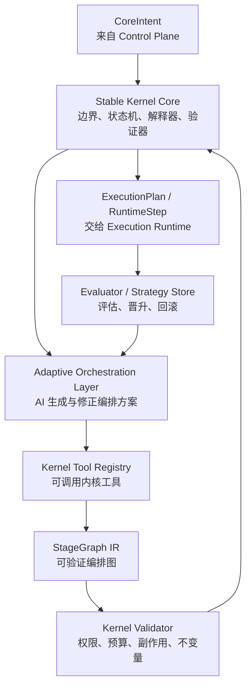

# TianShu Kernel / Core Loop 设计规范

## 1. 文档定位

本文是 `Kernel / Core Loop Plane` 的专项设计基线，用于细化 `docs/tianshu-architecture-spec.md` 中的可控演化内核。本文只描述当前正式设计，不记录历史方案、讨论过程或临时实现。

Kernel 的目标是承载 TianShu 的核心智能循环：它接收 Control Plane 归一化后的核心意图，在稳定边界内生成、验证、执行和演化 StageGraph，并把批准后的 runtime step 交给 Execution Runtime。

## 2. 涉及项目与代码归属

Kernel 设计落地时必须先确认代码所有权。当前实现可以暂时桥接既有项目，但新增 contracts、接口骨架和核心实现必须按本节目标项目归属落位，避免继续把 Kernel 语义堆入 AppHost 或 RuntimeComposition。

### 2.1 当前涉及项目

| 项目 | 当前关系 | 目标要求 |
| --- | --- | --- |
| `src/Contracts/TianShu.Contracts.Orchestration` | 现有 Stage / orchestration 契约来源之一。 | 只作为迁移输入或兼容桥接，不作为新 Kernel IR 的最终归属。 |
| `src/Contracts/TianShu.Contracts.Execution` | 现有执行契约来源。 | 承载 Execution Runtime 可消费的 `RuntimeStep` / `ExecutionPlan` 公共契约。 |
| `src/Contracts/TianShu.Contracts.Tools` | 现有工具契约来源。 | 承载统一 Tool descriptor、schema、permission、side effect、audit 基础契约。 |
| `src/Contracts/TianShu.Contracts.Governance` | 治理、权限、审批相关契约。 | 为 `GovernanceEnvelope`、policy id 和 human gate 提供基础类型或引用。 |
| `src/Contracts/TianShu.Contracts.Sessions` | session / thread 相关契约。 | 为 `KernelSubjectRef` 提供 session/thread 引用来源。 |
| `src/Contracts/TianShu.Contracts.Diagnostics` | 诊断事件契约。 | 承载 Kernel trace / validation rejection 的诊断投影契约。 |
| `src/Contracts/TianShu.Contracts.Projections` | 投影契约。 | 承载 Host Gateway 可消费的 `KernelProjection`。 |
| `src/Core/TianShu.ControlPlane.Abstractions` | Control Plane typed surface。 | 只负责向 Kernel 传递治理后的 `CoreIntent`。 |
| `src/Core/TianShu.ControlPlane` | Control Plane 实现。 | 不承载 turn/stage 编排，只做 operation 归一化、治理和路由。 |
| `src/Core/TianShu.RuntimeComposition` | 现有运行时装配。 | 只保留 composition root 职责，未来装配 Kernel 项目，不拥有 Kernel 语义。 |
| `src/Execution/TianShu.Execution.Runtime` | 现有执行运行时。 | 只消费已批准 `ExecutionPlan` / `RuntimeStep`，不生成 Kernel proposal。 |
| `src/Core/TianShu.HostGateway` | 宿主网关。 | 只暴露 `KernelProjection`，不暴露可变 Kernel 内部对象。 |
| `src/Hosting/TianShu.AppHost` | 现有宿主进程和部分 runtime 逻辑所在地。 | 只能作为宿主入口和装配边界，Kernel 语义必须迁出。 |
| `src/Hosting/TianShu.AppHost.Tools.Runtime` | 现有工具运行时逻辑所在地。 | 未来只作为 Execution Runtime / Module bridge 的实现输入，不拥有 ToolUse 语义。 |

### 2.2 目标新建项目

| 目标项目 | 状态 | 归属内容 |
| --- | --- | --- |
| `src/Contracts/TianShu.Contracts.Kernel/TianShu.Contracts.Kernel.csproj` | 已新建 | `CoreIntent`、`StageGraph`、`KernelProposal`、`KernelOperation`、`KernelProjection`、`KernelTrace`、strategy lifecycle 等 Kernel 公共契约。 |
| `src/Core/TianShu.Kernel.Abstractions/TianShu.Kernel.Abstractions.csproj` | 已新建 | `IStableKernelCore`、`IAdaptiveOrchestrator`、`IAdaptiveStageGraphCandidateGenerator`、`IAdaptiveCandidateValidationService`、`IAdaptiveCandidateTrialService`、`IKernelValidator`、`IStageGraphInterpreter`、trace/evaluator/strategy registry 抽象。 |
| `src/Core/TianShu.Kernel/TianShu.Kernel.csproj` | 已新建 | Stable Kernel Core、StageGraph interpreter、validator 默认实现、candidate validation / trial service、状态机、trace emission。 |
| `src/Core/TianShu.Kernel.Adaptive/TianShu.Kernel.Adaptive.csproj` | 已新建 | Adaptive Orchestration Layer、KernelTool 调用编排、AI proposal 生成与修正。 |
| `src/Core/TianShu.Kernel.Strategies/TianShu.Kernel.Strategies.csproj` | 已新建 | Strategy registry、strategy lifecycle、promotion / rollback、evaluation evidence 管理。 |
| `tests/TianShu.Kernel.Abstractions.Tests/TianShu.Kernel.Abstractions.Tests.csproj` | 已新建 | Kernel 抽象层接口存在性、契约复用和依赖边界测试。 |
| `tests/TianShu.Kernel.Tests/TianShu.Kernel.Tests.csproj` | 已新建 | Kernel contracts、validator、interpreter、state machine、strategy lifecycle 的验收测试。 |
| `tests/TianShu.Kernel.Adaptive.Tests/TianShu.Kernel.Adaptive.Tests.csproj` | 已新建 | Adaptive Orchestration Layer、KernelTool 家族和 Module Plane / RuntimeStep 边界测试。 |
| `tests/TianShu.Kernel.Strategies.Tests/TianShu.Kernel.Strategies.Tests.csproj` | 已新建 | Strategy lifecycle、promotion gate、rollback、replay compatibility 和 Kernel evaluation 测试。 |

### 2.3 项目归属规则

- Kernel 公共数据结构默认进入 `TianShu.Contracts.Kernel`。
- Kernel service 抽象默认进入 `TianShu.Kernel.Abstractions`。
- Stable Kernel Core 的默认实现默认进入 `TianShu.Kernel`。
- AI 驱动的 StageGraph 候选生成、proposal 生成和修正默认进入 `TianShu.Kernel.Adaptive`。
- strategy lifecycle、evaluation evidence 和 rollback 记录默认进入 `TianShu.Kernel.Strategies`。
- Execution Runtime 只实现 `ExecutionPlan` / `RuntimeStep` bridge，不得拥有 `StageGraph` 解释权。
- AppHost、HostGateway、RuntimeComposition 只能装配和投影 Kernel，不得拥有 Kernel 内部状态机或编排语义。

## 3. Kernel 总体结构

Kernel 由两个子层和四类支撑组件组成：

```text
Kernel / Core Loop Plane
  - Stable Kernel Core
  - Adaptive Orchestration Layer

Supporting Components
  - StageGraph IR
  - Kernel Tool Registry
  - Kernel Validator
  - Strategy / Evaluation Store
```



Stable Kernel Core 是唯一可以批准 StageGraph 和 RuntimeStep 的组件。Adaptive Orchestration Layer 可以提出、修正和评估编排方案，但不能绕过 Stable Kernel Core。

## 4. 输入与输出边界

### 4.1 Kernel 输入

Kernel 只接收 Control Plane 归一化后的核心意图。允许的输入类别包括：

| 输入 | 语义 |
| --- | --- |
| `TurnIntent` | 启动或继续一次用户 turn。 |
| `ResumeIntent` | 从 pause、checkpoint、interrupt 或 failed recovery 点恢复。 |
| `InterruptIntent` | 请求中断当前核心循环。 |
| `ReviewIntent` | 进入审查、复核或人工确认流程。 |
| `CompactionIntent` | 请求上下文压缩、摘要或 ledger 重组。 |
| `RecoveryIntent` | 对失败 stage 或失败 graph 生成恢复策略。 |
| `EvaluationIntent` | 对某次 run 或某个 strategy 进行评估。 |

Kernel 不接收原始宿主请求、UI 事件、provider wire payload、模块私有对象或未治理的 tool request。

### 4.2 Kernel 输出

Kernel 输出必须是类型化结果：

| 输出 | 消费方 | 语义 |
| --- | --- | --- |
| `ExecutionPlan` | Execution Runtime | 已批准的 runtime step 序列或图。 |
| `RuntimeStep` | Execution Runtime | 单个可执行步骤。 |
| `KernelStateUpdate` | State / Diagnostics Module | 核心状态、stage 状态、checkpoint、trace 引用。 |
| `KernelProjection` | Host Gateway | 可展示的 stage、graph、策略、恢复和评估视图。 |
| `KernelProposalResult` | Adaptive Orchestration Layer | proposal 的验证、拒绝、修正或批准结果。 |

Kernel 输出不得包含 secret、原始 provider payload、未脱敏路径、完整敏感上下文或模块私有状态。

## 5. Stable Kernel Core

Stable Kernel Core 是不可由 AI 直接修改或绕过的稳定内核。它负责：

- 接收并校验 `CoreIntent`。
- 选择默认 StageGraph 或加载已晋升策略。
- 调用 Adaptive Orchestration Layer 生成或修正 proposal。
- 验证 StageGraph、KernelOperation 和 RuntimeStep。
- 审查 Adaptive StageGraph 候选，并输出结构化候选验证报告。
- 对已验证候选执行 plan-only shadow / bounded trial，并输出差异报告。
- 维护 Kernel 状态机。
- 解释 StageGraph，并生成 ExecutionPlan。
- 执行 checkpoint、rollback、pause、resume、interrupt 语义。
- 生成 trace、diagnostics 和 projection 所需的最小内核记录。

Stable Kernel Core 必须保持以下不变量：

- 未经 Control Plane 治理的输入不得进入 Kernel。
- 未经 Stable Kernel Core 验证的 StageGraph 不得执行。
- 未经 Stable Kernel Core 批准的 RuntimeStep 不得进入 Execution Runtime。
- 所有外部副作用必须可授权、可审计、可追踪、可回放。
- AI 不得直接写 Kernel 持久状态。
- AI 不得直接修改长期晋升策略。
- 高风险策略晋升必须经过人工 gate。

## 6. Adaptive Orchestration Layer

Adaptive Orchestration Layer 是 AI 可参与的自适应编排层。它不执行外部能力，只产出 proposal。

它可以提出：

- Stage 定义。
- StageGraph。
- StageGraph 修正。
- 模型路由策略。
- 工具选择策略。
- 上下文策略。
- checkpoint 策略。
- recovery plan。
- evaluation plan。
- strategy promotion / rollback 建议。

它不得直接：

- 执行 tool。
- 调用 provider。
- 写状态库。
- 修改 Stable Kernel Core。
- 放宽 governance envelope。
- 加载未知模块。
- 晋升高风险策略。

Adaptive Orchestration Layer 的输出必须是 `KernelProposal`，并包含：

| 字段 | 语义 |
| --- | --- |
| `proposalId` | proposal 标识。 |
| `sourceIntentId` | 来源核心意图。 |
| `proposalKind` | proposal 类型。 |
| `payload` | 结构化提案内容。 |
| `expectedOutcome` | 预期结果。 |
| `riskProfile` | 风险和副作用声明。 |
| `requiredTools` | 需要的 KernelTool / CapabilityTool。 |
| `budgetImpact` | 预算影响。 |
| `rollbackPlan` | 回滚方案。 |
| `evaluationPlan` | 评估方案。 |

## 7. StageGraph IR

StageGraph 是 Kernel 可解释、可验证、可回放的编排中间表示。AI 不能用自然语言 plan 直接驱动执行，必须生成 StageGraph 或对既有 StageGraph 提交结构化修正。

### 7.1 StageGraph

`StageGraph` 必须至少包含：

| 字段 | 语义 |
| --- | --- |
| `graphId` | 全局唯一标识。 |
| `version` | 版本号。 |
| `intentType` | 适用的核心意图类型。 |
| `entryStageId` | 入口 Stage。 |
| `stages` | Stage 集合。 |
| `edges` | Stage 之间的可达关系。 |
| `policies` | 权限、治理、上下文和副作用策略。 |
| `budgets` | token、时间、成本、重试、工具调用预算。 |
| `checkpointRules` | checkpoint 创建、提交、恢复规则。 |
| `recoveryRules` | 失败、超时、中断、回滚、降级规则。 |
| `evaluationRules` | 运行后评估和晋升规则。 |
| `metadata` | 来源、创建者、trust level、trace 引用。 |

### 7.2 Stage

`Stage` 必须至少包含：

| 字段 | 语义 |
| --- | --- |
| `stageId` | Stage 标识。 |
| `kind` | Stage 类型。 |
| `objective` | 当前 Stage 的目标。 |
| `inputContract` | 输入契约。 |
| `outputContract` | 输出契约。 |
| `allowedKernelTools` | 允许调用的 KernelTool。 |
| `allowedCapabilityTools` | 允许请求的 CapabilityTool。 |
| `modelRoutePolicy` | 模型路由约束。 |
| `contextPolicy` | 上下文读取、压缩和引用策略。 |
| `sideEffectLevel` | 副作用等级。 |
| `budget` | 本 Stage 预算。 |
| `successCriteria` | 成功条件。 |
| `failureHandler` | 失败处理入口。 |

### 7.3 Edge

`StageEdge` 必须至少包含：

| 字段 | 语义 |
| --- | --- |
| `fromStageId` | 起始 Stage。 |
| `toStageId` | 目标 Stage。 |
| `condition` | 跳转条件。 |
| `guard` | 权限、状态、预算或人工确认 guard。 |
| `transitionKind` | normal、retry、recover、pause、finish、fail。 |

Graph 必须有唯一入口，必须能到达终态，必须有循环上限。没有终态、无限循环、不可达入口或越权 edge 的 graph 必须 fail closed。

## 8. Kernel ToolUse

Kernel ToolUse 是 AI 操作内核编排机制的唯一入口。Kernel ToolUse 只生成 `KernelOperation` 或 `KernelProposal`，不得直接产生外部副作用。

正式 KernelTool 家族：

| Tool | 用途 | 输出 |
| --- | --- | --- |
| `propose_stage` | 提出单个 Stage。 | `KernelProposal<Stage>` |
| `compose_stage_graph` | 组合 StageGraph。 | `KernelProposal<StageGraph>` |
| `revise_stage_graph` | 修正既有 StageGraph。 | `KernelProposal<StageGraphPatch>` |
| `select_model_route` | 提出模型路由策略。 | `KernelProposal<ModelRoutePolicy>` |
| `select_tool_strategy` | 提出工具选择策略。 | `KernelProposal<ToolStrategy>` |
| `request_capability_call` | 请求将某个能力调用物化为 RuntimeStep。 | `KernelOperation<RequestCapabilityCall>` |
| `update_context_policy` | 提出上下文读取、裁剪、摘要策略。 | `KernelProposal<ContextPolicy>` |
| `propose_checkpoint` | 提出 checkpoint 点。 | `KernelOperation<CheckpointProposal>` |
| `propose_recovery_plan` | 提出失败恢复策略。 | `KernelProposal<RecoveryPlan>` |
| `evaluate_run` | 评估某次运行。 | `KernelOperation<EvaluationRequest>` |
| `promote_strategy` | 请求晋升策略。 | `KernelProposal<StrategyPromotion>` |
| `rollback_strategy` | 请求回滚策略。 | `KernelOperation<StrategyRollback>` |
| `propose_kernel_policy_change` | 提出内核策略变更。 | `KernelProposal<PolicyChange>` |

`propose_kernel_policy_change` 永远不能自动生效。它只能进入人工 gate 或低风险 trial 队列。

## 9. Capability ToolUse 与 RuntimeStep

Capability ToolUse 是 AI 请求外部能力的入口，但 AI 不直接调用 Module Plane。标准链路是：

```text
KernelTool.request_capability_call
  -> KernelOperation<RequestCapabilityCall>
  -> Stable Kernel Core validate
  -> RuntimeStep
  -> Execution Runtime
  -> Module Plane
```

`RuntimeStep` 主要类型：

| 类型 | 语义 |
| --- | --- |
| `ModelInvocationStep` | 调用 provider module。 |
| `ToolInvocationStep` | 调用 tool module。 |
| `StateCommitStep` | 提交受控状态。 |
| `ArtifactStep` | 发布、附加、晋升或投影 artifact。 |
| `DiagnosticStep` | 写入诊断事件。 |
| `HostInteractionStep` | 请求用户输入、暂停、恢复或中断。 |
| `ModuleCapabilityStep` | 调用非工具形态的模块能力。 |

RuntimeStep 必须包含：

- `stepId`。
- `sourceIntentId`。
- `sourceGraphId`。
- `sourceStageId`。
- `sourceKernelOperationId`。
- `toolOrModuleId`。
- `inputEnvelope`。
- `permissionEnvelope`。
- `sideEffectProfile`。
- `budget`。
- `expectedOutputContract`。
- `tracePolicy`。

## 10. Kernel Validator

Kernel Validator 是 Stable Kernel Core 的组成部分。它必须在以下边界执行验证：

| 验证点 | 验证对象 |
| --- | --- |
| Intent admission | `CoreIntent` 是否来自 Control Plane，是否带有 governance envelope。 |
| Proposal validation | `KernelProposal` 是否结构有效，是否声明风险、预算和回滚方案。 |
| Graph validation | `StageGraph` 是否可达、可终止、预算有界、edge 合法。 |
| Tool validation | KernelTool / CapabilityTool 是否在当前 Stage 允许集合内。 |
| Side effect validation | 副作用等级是否被当前 policy 允许。 |
| Budget validation | token、时间、成本、重试和工具调用预算是否足够。 |
| State validation | 当前 Kernel 状态是否允许进入目标 Stage。 |
| Promotion validation | 策略晋升是否有评估证据、trace 和 rollback plan。 |

验证失败必须 fail closed，并生成可投影的 rejection reason。不得静默降级为不受控执行。

## 11. Kernel 状态机

Kernel run 的状态机：

```text
Created
  -> IntentAccepted
  -> GraphSelected
  -> ProposalPending
  -> GraphValidated
  -> Executing
  -> Paused
  -> Recovering
  -> Completed
  -> Failed
  -> RolledBack
```

规则：

- `Created` 只能由 Control Plane 创建。
- `GraphValidated` 之前不得生成可执行 RuntimeStep。
- `Executing` 只能由 Execution Runtime 的 step result 驱动前进。
- `Paused` 必须保存 resume token 和 checkpoint reference。
- `Recovering` 必须绑定 failed stage、error signal 和 recovery graph。
- `Completed`、`Failed`、`RolledBack` 是终态。

## 12. Trace、Replay 与 Evaluation

Kernel 必须为每次 run 生成可回放 trace。trace 至少包含：

- intent。
- selected graph。
- proposal 列表。
- validation result。
- approved runtime steps。
- step result。
- checkpoint。
- recovery decision。
- evaluation result。
- strategy promotion / rollback decision。

Evaluator 必须从 trace 中生成：

- success / failure。
- expected outcome 对比 actual outcome。
- token / cost / latency。
- tool failure rate。
- recovery success rate。
- user correction。
- policy violation attempt。
- replay compatibility。

评价结果必须是结构化 evidence，而不是只有自然语言摘要或扁平分数。`KernelEvaluationResult` 必须至少能携带：

- `KernelEvaluationEvidenceSet`：trace、runtime metrics、diagnostics、objective anchor、model judge、human feedback 引用。
- `KernelEvaluationMetricObservation`：指标 id、指标类型、信号来源、score 或 observed value、unit、weight、confidence、estimated flag 与 evidence ref。
- `KernelEvaluationDisagreement`：冲突指标、冲突类型、原因、severity、human gate 要求和 evidence ref。
- `overallConfidence` 与 `disagreementScore`：只作为评价信号，不是 promotion 决策。

`estimated=true` 的 token / cost / latency 只能作为 diagnostics 和降级参考；provider 未返回 usage 时必须记录缺失原因，不得把估算值冒充真实 provider usage 或真实 cost。模型裁判属于 `ModelJudge` 信号，不能单独决定 promotion；客观锚点与模型裁判冲突时必须生成 disagreement，并进入人工 gate、继续 trial 或后续统计聚合。

异质交叉评审是 evaluation 的模型裁判实验形态：执行者 A 的 run / trace / baseline evaluation 作为被评审对象，至少两个不同 provider/model 的评审者 B/C 提交结构化评分、理由、置信度和不确定性。Kernel 只聚合这些评审提交并生成 `ModelJudge` observations 与 `ModelJudgeDisagreement`；真实评审 provider 调用必须通过后续受治理 RuntimeStep / Module 路径接入，不得由 evaluator 私自调用 provider。

客观锚点校准是 evaluation 的确定性证据校准形态：已采集的 build succeeded、tests passed、golden answer、human label 作为 objective anchor 输入，用来校准模型裁判 observation 的 confidence。Kernel 只消费这些锚点证据并生成 `ObjectiveAnchor` observations 与 `ObjectiveAnchorConflict`；它不得自行运行 build/test，不得把单个锚点或单轮校准结果直接晋升为 strategy promotion 依据。

没有 trace 的策略不得晋升为长期策略。

## 13. 策略生命周期

长期编排资产必须版本化，并经过生命周期管理：

```text
candidate
  -> trial
  -> promoted
  -> deprecated
  -> rolled_back
```

| 状态 | 允许行为 |
| --- | --- |
| `candidate` | 已登记候选策略，必须有 evidence 和 lifecycle audit record，不可直接作为默认策略。 |
| `trial` | 可在限定 intent、限定预算和限定工具集合内执行。 |
| `promoted` | 可作为同类 intent 的候选策略。 |
| `deprecated` | 不再被新 run 选择，但保留 replay 能力。 |
| `rolled_back` | 因失败、越权或退化被回滚，必须保留原因。 |

`draft` / `validated` 仅作为既有代码兼容边界，不属于正式演化主链。新的 registry 写入必须从 `candidate` 开始。

晋升条件：

- 连续或累计成功指标优于基线。
- 没有未解释的 policy violation。
- 有完整 trace。
- 有 rollback plan。
- 成本、延迟或成功率具备明确收益。
- 高风险策略经过人工确认。

## 14. 与其他层的接口

| 层 | 交互 |
| --- | --- |
| Control Plane -> Kernel | 只传入 `CoreIntent`、governance envelope、session/thread/workflow reference。 |
| Kernel -> Control Plane | 返回 intent 接受、拒绝、暂停、恢复、失败、完成等控制结果。 |
| Kernel -> Execution Runtime | 只输出已批准的 `ExecutionPlan` / `RuntimeStep`。 |
| Execution Runtime -> Kernel | 返回 step result、error signal、interrupt、checkpoint materialization。 |
| Kernel -> Module Plane | 不直接调用模块；必须通过 Execution Runtime。 |
| Kernel -> Host Gateway | 只暴露 `KernelProjection`，不暴露可变内部对象。 |
| Module Plane -> Kernel | 不反向调用 Kernel；只能通过 Execution Runtime 返回结果。 |

## 15. 完整落地接口基线

本节定义完整目标形态的接口骨架。后续实现可以分阶段交付，但 contracts、测试骨架和验收口径必须面向本节的完整形态，而不是只面向最小闭环。

接口命名是设计基线，不要求实现时逐字使用同一 namespace；但职责、输入输出和边界不得弱化。

### 15.1 Core intent 与治理信封

归属项目：`src/Contracts/TianShu.Contracts.Kernel/TianShu.Contracts.Kernel.csproj`（已新建）。依赖来源可引用 `TianShu.Contracts.Governance`、`TianShu.Contracts.Sessions`、`TianShu.Contracts.Workflows`、`TianShu.Contracts.Primitives`。

```csharp
public abstract record CoreIntent(
    string IntentId,
    string IntentType,
    KernelSubjectRef Subject,
    GovernanceEnvelope Governance,
    KernelBudget Budget,
    IReadOnlyDictionary<string, string> Metadata);

public sealed record TurnIntent(
    string IntentId,
    KernelSubjectRef Subject,
    GovernanceEnvelope Governance,
    KernelBudget Budget,
    string UserInputRef,
    IReadOnlyDictionary<string, string> Metadata)
    : CoreIntent(IntentId, "turn", Subject, Governance, Budget, Metadata);

public sealed record ResumeIntent(
    string IntentId,
    KernelSubjectRef Subject,
    GovernanceEnvelope Governance,
    KernelBudget Budget,
    string ResumeToken,
    string CheckpointRef,
    IReadOnlyDictionary<string, string> Metadata)
    : CoreIntent(IntentId, "resume", Subject, Governance, Budget, Metadata);

public sealed record RecoveryIntent(
    string IntentId,
    KernelSubjectRef Subject,
    GovernanceEnvelope Governance,
    KernelBudget Budget,
    string FailedRunId,
    string FailedStageId,
    string ErrorSignalRef,
    IReadOnlyDictionary<string, string> Metadata)
    : CoreIntent(IntentId, "recovery", Subject, Governance, Budget, Metadata);

public sealed record KernelSubjectRef(
    string SessionId,
    string ThreadId,
    string? WorkflowId,
    string? TurnId);

public sealed record GovernanceEnvelope(
    string EnvelopeId,
    IReadOnlyList<string> PolicyIds,
    IReadOnlyList<string> AllowedToolIds,
    IReadOnlyList<string> AllowedModuleIds,
    SideEffectLevel MaxSideEffectLevel,
    bool RequiresHumanGate);
```

Control Plane 只能向 Kernel 传入 `CoreIntent` 家族对象。未携带 `GovernanceEnvelope` 的输入必须被 Stable Kernel Core 拒绝。

### 15.2 Stable Kernel Core

归属项目：接口位于 `src/Core/TianShu.Kernel.Abstractions/TianShu.Kernel.Abstractions.csproj`（已新建）；默认实现位于 `src/Core/TianShu.Kernel/TianShu.Kernel.csproj`（已新建）。

```csharp
public interface IStableKernelCore
{
    ValueTask<KernelRunResult> RunAsync(
        CoreIntent intent,
        KernelRunOptions options,
        CancellationToken cancellationToken);

    ValueTask<KernelValidationResult> ValidateGraphAsync(
        StageGraph graph,
        KernelValidationContext context,
        CancellationToken cancellationToken);

    ValueTask<ExecutionPlan> ApproveExecutionPlanAsync(
        StageGraph graph,
        KernelRunState state,
        CancellationToken cancellationToken);

    ValueTask<KernelProposalResult> ReviewProposalAsync(
        KernelProposal proposal,
        KernelValidationContext context,
        CancellationToken cancellationToken);
}
```

`IStableKernelCore` 是 Kernel 的唯一批准入口。Adaptive Orchestration Layer、KernelTool、Strategy Registry 或 Execution Runtime 都不得绕过该接口产生可执行计划。

### 15.3 Adaptive Orchestration Layer

归属项目：接口位于 `src/Core/TianShu.Kernel.Abstractions/TianShu.Kernel.Abstractions.csproj`（已新建）；AI proposal 默认实现位于 `src/Core/TianShu.Kernel.Adaptive/TianShu.Kernel.Adaptive.csproj`（已新建）。

```csharp
public interface IAdaptiveOrchestrator
{
    Task<KernelProposalSet> ProposeAsync(
        CoreIntent intent,
        KernelRunState state,
        KernelRunOptions options,
        CancellationToken cancellationToken = default);

    Task<KernelProposalSet> ReviseAsync(
        KernelValidationResult validationResult,
        KernelRunState state,
        KernelRunOptions options,
        CancellationToken cancellationToken = default);
}

public interface IAdaptiveStageGraphCandidateGenerator
{
    Task<IReadOnlyList<StageGraphProposal>> GenerateCandidatesAsync(
        CoreIntent intent,
        KernelRunState state,
        KernelRunOptions options,
        CancellationToken cancellationToken = default);
}

public interface IAdaptiveCandidateValidationService
{
    Task<AdaptiveCandidateValidationReport> ValidateCandidatesAsync(
        AdaptiveCandidateValidationRequest request,
        CancellationToken cancellationToken = default);
}

public interface IAdaptiveCandidateTrialService
{
    Task<AdaptiveCandidateTrialReport> RunTrialsAsync(
        AdaptiveCandidateTrialRequest request,
        CancellationToken cancellationToken = default);
}
```

Adaptive Orchestration Layer 只能返回 `KernelProposalSet`。StageGraph candidate generator 只能返回多个结构化 `StageGraphProposal`。候选验证服务只能验证和产出 `AdaptiveCandidateValidationReport`，不得执行候选、不得触发 trial、不得晋升 strategy。候选 trial 服务只能执行 plan-only `ShadowRun` / `BoundedPlanTrial`，即物化并验证候选 ExecutionPlan、记录与基线的差异；它不得调用 Execution Runtime，不得产生外部副作用，不得晋升 strategy。上述组件都不得直接访问 Module Plane。

### 15.4 StageGraph IR 接口形态

归属项目：`src/Contracts/TianShu.Contracts.Kernel/TianShu.Contracts.Kernel.csproj`（已新建）。既有 `TianShu.Contracts.Orchestration` 只能作为迁移输入或 bridge。

```csharp
public sealed record StageGraph(
    string GraphId,
    string Version,
    string IntentType,
    string EntryStageId,
    IReadOnlyList<StageNode> Stages,
    IReadOnlyList<StageEdge> Edges,
    GraphPolicySet Policies,
    KernelBudget Budgets,
    CheckpointRules CheckpointRules,
    RecoveryRules RecoveryRules,
    EvaluationRules EvaluationRules,
    StageGraphMetadata Metadata);

public sealed record StageNode(
    string StageId,
    string Kind,
    string Objective,
    ContractRef InputContract,
    ContractRef OutputContract,
    IReadOnlyList<string> AllowedKernelToolIds,
    IReadOnlyList<string> AllowedCapabilityToolIds,
    ModelRoutePolicy ModelRoutePolicy,
    ContextPolicy ContextPolicy,
    SideEffectLevel SideEffectLevel,
    KernelBudget Budget,
    SuccessCriteria SuccessCriteria,
    FailureHandlerRef FailureHandler);

public sealed record StageEdge(
    string FromStageId,
    string ToStageId,
    TransitionCondition Condition,
    TransitionGuard Guard,
    StageTransitionKind TransitionKind);
```

StageGraph 是 Kernel 可执行编排资产的唯一 IR。既有固定 Stage 配置可以作为内置 graph 的来源之一，但不得成为绕过 StageGraph 的执行入口。

### 15.5 Kernel proposal 与 operation

归属项目：`src/Contracts/TianShu.Contracts.Kernel/TianShu.Contracts.Kernel.csproj`（已新建）。

```csharp
public abstract record KernelProposal(
    string ProposalId,
    string SourceIntentId,
    string ProposalKind,
    RiskProfile RiskProfile,
    KernelBudgetImpact BudgetImpact,
    RollbackPlan RollbackPlan,
    EvaluationPlan EvaluationPlan);

public sealed record StageGraphProposal(
    string ProposalId,
    string SourceIntentId,
    StageGraph Graph,
    RiskProfile RiskProfile,
    KernelBudgetImpact BudgetImpact,
    RollbackPlan RollbackPlan,
    EvaluationPlan EvaluationPlan)
    : KernelProposal(ProposalId, SourceIntentId, "stage_graph", RiskProfile, BudgetImpact, RollbackPlan, EvaluationPlan);

public abstract record KernelOperation(
    string OperationId,
    string SourceIntentId,
    string SourceStageId,
    string OperationKind,
    PermissionEnvelope Permission,
    SideEffectProfile SideEffect);

public sealed record RequestCapabilityCallOperation(
    string OperationId,
    string SourceIntentId,
    string SourceStageId,
    string CapabilityToolId,
    object InputEnvelope,
    PermissionEnvelope Permission,
    SideEffectProfile SideEffect)
    : KernelOperation(OperationId, SourceIntentId, SourceStageId, "request_capability_call", Permission, SideEffect);
```

`KernelProposal` 表示可被接受、拒绝或修正的提案；`KernelOperation` 表示当前 graph 运行中请求 Stable Kernel Core 判断的操作。两者都不是直接执行命令。

### 15.6 Tool 统一接口

归属项目：`src/Contracts/TianShu.Contracts.Tools/TianShu.Contracts.Tools.csproj`（现有）承载通用 `ITianShuTool`、`ToolDescriptor`、schema、permission、side effect、audit；`src/Contracts/TianShu.Contracts.Kernel/TianShu.Contracts.Kernel.csproj`（已新建）承载 `IKernelTool` 返回的 Kernel 语义结果类型。

```csharp
public interface ITianShuTool
{
    ToolDescriptor Descriptor { get; }

    ValueTask<ToolInvocationResult> InvokeAsync(
        ToolInvocationEnvelope invocation,
        ToolInvocationContext context,
        CancellationToken cancellationToken);
}

public interface IKernelTool : ITianShuTool
{
    ValueTask<KernelToolResult> InvokeKernelAsync(
        KernelToolInvocation invocation,
        KernelToolContext context,
        CancellationToken cancellationToken);
}

public interface ICapabilityTool : ITianShuTool
{
    ValueTask<CapabilityToolResult> InvokeCapabilityAsync(
        CapabilityToolInvocation invocation,
        CapabilityToolContext context,
        CancellationToken cancellationToken);
}

public sealed record ToolDescriptor(
    string ToolId,
    string Name,
    ToolKind Kind,
    string Description,
    JsonSchemaRef InputSchema,
    JsonSchemaRef OutputSchema,
    PermissionDeclaration Permissions,
    SideEffectProfile SideEffects,
    AuditProfile Audit);
```

Registry、discovery、authorization、audit 和 diagnostics 层只依赖 `ITianShuTool` 与 `ToolDescriptor`。Kernel 语义层必须按 `ToolKind` 分派到 `IKernelTool` 或 `ICapabilityTool`。

### 15.7 Kernel validator

归属项目：接口位于 `src/Core/TianShu.Kernel.Abstractions/TianShu.Kernel.Abstractions.csproj`（已新建）；默认实现位于 `src/Core/TianShu.Kernel/TianShu.Kernel.csproj`（已新建）。

```csharp
public interface IKernelValidator
{
    ValueTask<KernelValidationResult> ValidateIntentAsync(
        CoreIntent intent,
        CancellationToken cancellationToken);

    ValueTask<KernelValidationResult> ValidateProposalAsync(
        KernelProposal proposal,
        KernelValidationContext context,
        CancellationToken cancellationToken);

    ValueTask<KernelValidationResult> ValidateGraphAsync(
        StageGraph graph,
        KernelValidationContext context,
        CancellationToken cancellationToken);

    ValueTask<KernelValidationResult> ValidateOperationAsync(
        KernelOperation operation,
        KernelValidationContext context,
        CancellationToken cancellationToken);

    ValueTask<KernelValidationResult> ValidateRuntimeStepAsync(
        RuntimeStep step,
        KernelValidationContext context,
        CancellationToken cancellationToken);
}

public sealed record KernelValidationResult(
    bool IsValid,
    IReadOnlyList<KernelValidationIssue> Issues,
    KernelValidationDecision Decision);
```

所有验证失败默认 `fail closed`。只有 `KernelValidationDecision.Approved` 可以进入下一阶段。

### 15.8 StageGraph interpreter 与 execution plan

归属项目：接口位于 `src/Core/TianShu.Kernel.Abstractions/TianShu.Kernel.Abstractions.csproj`（已新建）；默认解释器位于 `src/Core/TianShu.Kernel/TianShu.Kernel.csproj`（已新建）；`ExecutionPlan` 公共契约位于 `src/Contracts/TianShu.Contracts.Execution/TianShu.Contracts.Execution.csproj`（现有）。

```csharp
public interface IStageGraphInterpreter
{
    ValueTask<ExecutionPlan> BuildExecutionPlanAsync(
        StageGraph graph,
        KernelRunState state,
        KernelInterpreterContext context,
        CancellationToken cancellationToken);

    ValueTask<StageTransitionDecision> SelectNextStageAsync(
        StageGraph graph,
        KernelRunState state,
        StageResult lastStageResult,
        CancellationToken cancellationToken);
}

public sealed record ExecutionPlan(
    string PlanId,
    string SourceGraphId,
    string SourceIntentId,
    IReadOnlyList<RuntimeStep> Steps,
    ExecutionPlanPolicy Policy,
    TracePolicy TracePolicy);
```

Interpreter 只把已验证 StageGraph 物化为 ExecutionPlan。它不得调用 provider、tool、state store 或 artifact store。

### 15.9 RuntimeStep 与执行边界

归属项目：`RuntimeStep` 公共契约位于 `src/Contracts/TianShu.Contracts.Execution/TianShu.Contracts.Execution.csproj`（现有）；执行实现位于 `src/Execution/TianShu.Execution.Runtime/TianShu.Execution.Runtime.csproj`（现有）。

```csharp
public abstract record RuntimeStep(
    string StepId,
    string SourceIntentId,
    string SourceGraphId,
    string SourceStageId,
    string SourceKernelOperationId,
    PermissionEnvelope Permission,
    SideEffectProfile SideEffect,
    KernelBudget Budget,
    ContractRef ExpectedOutputContract,
    TracePolicy TracePolicy);

public sealed record ModelInvocationStep(
    string StepId,
    string SourceIntentId,
    string SourceGraphId,
    string SourceStageId,
    string SourceKernelOperationId,
    string ProviderModuleId,
    ModelRoutePolicy ModelRoute,
    object InputEnvelope,
    PermissionEnvelope Permission,
    SideEffectProfile SideEffect,
    KernelBudget Budget,
    ContractRef ExpectedOutputContract,
    TracePolicy TracePolicy)
    : RuntimeStep(StepId, SourceIntentId, SourceGraphId, SourceStageId, SourceKernelOperationId, Permission, SideEffect, Budget, ExpectedOutputContract, TracePolicy);

public sealed record ToolInvocationStep(
    string StepId,
    string SourceIntentId,
    string SourceGraphId,
    string SourceStageId,
    string SourceKernelOperationId,
    string CapabilityToolId,
    object InputEnvelope,
    PermissionEnvelope Permission,
    SideEffectProfile SideEffect,
    KernelBudget Budget,
    ContractRef ExpectedOutputContract,
    TracePolicy TracePolicy)
    : RuntimeStep(StepId, SourceIntentId, SourceGraphId, SourceStageId, SourceKernelOperationId, Permission, SideEffect, Budget, ExpectedOutputContract, TracePolicy);
```

Execution Runtime 只接收 `ExecutionPlan` 或 `RuntimeStep`。任何没有 `SourceGraphId`、`SourceStageId`、`SourceKernelOperationId` 和 `PermissionEnvelope` 的步骤必须被拒绝。

### 15.10 Trace、evaluation 与 strategy registry

归属项目：trace / evaluation 公共契约位于 `src/Contracts/TianShu.Contracts.Kernel/TianShu.Contracts.Kernel.csproj`（已新建）；diagnostics 投影可引用 `src/Contracts/TianShu.Contracts.Diagnostics/TianShu.Contracts.Diagnostics.csproj`（现有）；strategy registry 实现位于 `src/Core/TianShu.Kernel.Strategies/TianShu.Kernel.Strategies.csproj`（已新建）。

```csharp
public interface IKernelTraceStore
{
    ValueTask AppendAsync(
        KernelTraceEvent traceEvent,
        CancellationToken cancellationToken);

    ValueTask<KernelRunTrace?> ReadRunTraceAsync(
        string runId,
        CancellationToken cancellationToken);
}

public interface IKernelEvaluator
{
    Task<KernelEvaluationResult> EvaluateAsync(
        KernelRunResult result,
        KernelRunTrace trace,
        EvaluationPlan evaluationPlan,
        CancellationToken cancellationToken = default);
}

public interface IKernelCrossReviewExperimentService
{
    Task<KernelCrossReviewExperimentReport> RunAsync(
        KernelCrossReviewExperimentRequest request,
        CancellationToken cancellationToken = default);
}

public interface IKernelObjectiveAnchorCalibrationService
{
    Task<KernelObjectiveAnchorCalibrationReport> CalibrateAsync(
        KernelObjectiveAnchorCalibrationRequest request,
        CancellationToken cancellationToken = default);
}

public interface IKernelStrategyEvaluationAggregationService
{
    Task<KernelStrategyEvaluationAggregationReport> AggregateAsync(
        KernelStrategyEvaluationAggregationRequest request,
        CancellationToken cancellationToken = default);
}

public interface IStrategyRegistry
{
    Task<StrategyRecord?> GetPromotedAsync(
        CoreIntentKind intentKind,
        CancellationToken cancellationToken = default);

    Task<IReadOnlyList<StrategyRecord>> ListCandidatesAsync(
        CoreIntentKind intentKind,
        CancellationToken cancellationToken = default);

    Task<IReadOnlyList<StrategyLifecycleAuditRecord>> ListAuditRecordsAsync(
        StrategyId strategyId,
        CancellationToken cancellationToken = default);

    Task<StrategyRecord> SaveCandidateAsync(
        StrategyRecord strategy,
        IReadOnlyList<StrategyTransitionEvidence> evidence,
        CancellationToken cancellationToken = default);

    Task<StrategyRecord> TransitionAsync(
        StrategyId strategyId,
        StrategyLifecycleState targetState,
        IReadOnlyList<StrategyTransitionEvidence> evidence,
        CancellationToken cancellationToken = default);
}
```

没有 trace 的 strategy 不得晋升。没有 evaluation evidence、metric observation 和必要 disagreement 处理结果的 strategy 不得进入 `promoted`。当前默认 evaluator 只生成 trace / replay 相关的确定性基础指标；当前默认 cross-review service 只聚合已提交模型裁判结果，不直接调用 provider；当前默认 objective-anchor calibration service 只消费已采集的客观锚点，不直接执行 build/test；当前默认 strategy evaluation aggregation service 只聚合多次 evaluation / cross-review / objective-anchor calibration 样本，输出策略级统计比较、promotion-ready 信号和阻断原因，不执行 registry transition。当前默认 strategy registry 只执行 candidate / trial / promoted / deprecated / rolled_back 生命周期转换，并为每次 candidate 注册和状态转换写入 `StrategyLifecycleAuditRecord`。样本不足、只有模型裁判、存在 human-gate 分歧或客观锚点冲突时不得标记 promotion-ready。人工反馈扩展仍由后续 evaluator module 接入。

## 16. 完整落地形态

完整目标形态必须包含以下组件：

| 组件 | 必须能力 |
| --- | --- |
| `IStableKernelCore` | 接收 intent、验证 proposal / graph / step、批准 execution plan、维护状态机。 |
| `IAdaptiveOrchestrator` | 通过 AI 生成和修正 proposal，不直接执行外部副作用。 |
| `IAdaptiveStageGraphCandidateGenerator` | 生成多个结构化 StageGraph proposal，不返回自然语言 plan 或 RuntimeStep。 |
| `IAdaptiveCandidateValidationService` | 对多个候选生成 schema、deterministic kernel、governance、budget、capability 检查报告，不执行、不试运行、不晋升。 |
| `IAdaptiveCandidateTrialService` | 对已验证候选生成 shadow / bounded plan trial 差异报告，不调用 Execution Runtime、不晋升策略。 |
| `IStageGraphInterpreter` | 将已验证 StageGraph 解释成 ExecutionPlan。 |
| `IKernelValidator` | 在 intent、proposal、graph、operation、step、promotion 边界 fail-closed 验证。 |
| `ITianShuTool` registry | 统一发现、授权、审计 KernelTool 与 CapabilityTool。 |
| `IKernelTraceStore` | 记录可回放 trace。 |
| `IKernelEvaluator` | 将 run result、trace、runtime metrics、objective anchor、model judge 与 human feedback 投影为结构化 evaluation evidence。 |
| `IKernelCrossReviewExperimentService` | 聚合 A 执行、B/C 异质评审的结构化模型裁判提交，输出评分、理由、不确定性、分歧和 human gate 信号。 |
| `IKernelObjectiveAnchorCalibrationService` | 用已采集的 build/test/golden answer/human label 锚点校准模型裁判置信度，输出锚点冲突和 human gate 信号。 |
| `IKernelStrategyEvaluationAggregationService` | 聚合多次策略评价样本，输出策略级统计比较、阻断原因和 promotion-ready 证据信号，不执行晋升。 |
| `IStrategyRegistry` | 管理 candidate、trial、promoted、deprecated、rolled_back，并记录 lifecycle audit。 |
| Execution Runtime bridge | 只接受已批准 ExecutionPlan / RuntimeStep。 |
| Host Gateway projection | 只暴露 KernelProjection，不暴露可变内部对象。 |

阶段化交付只能决定实现顺序，不能降低最终接口边界：

1. 第一阶段建立 contracts、内置 StageGraph、validator、trace 和 ExecutionPlan bridge。
2. 第二阶段接入 KernelTool registry、Adaptive Orchestrator 和 recovery proposal。
3. 第三阶段接入 evaluator、strategy registry trial、replay。
4. 第四阶段接入 promoted 策略、rollback 和人工 gate。
5. 第五阶段开放第三方 KernelTool / CapabilityTool 扩展。

第一阶段可以不启用自动晋升，但接口上必须预留完整 lifecycle、trace、evaluation 和 rollback 形态。

## 17. 可行性约束

该设计可行的前提是：

- StageGraph 是结构化 IR，不是自然语言计划。
- KernelTool 与 CapabilityTool 统一注册、统一授权、统一审计。
- Stable Kernel Core 是唯一批准方。
- Execution Runtime 只执行 RuntimeStep。
- Module Plane 只响应授权能力调用。
- 所有 run 都有 trace。
- 所有策略都有版本。
- 所有长期晋升都有评估证据和回滚路径。

若无法满足以上任一约束，对应能力不得进入自动演化路径，只能作为人工确认后的固定策略或实验特性。

## 18. 验收标准

后续实现必须能通过以下验收：

- 给定 `TurnIntent`，Kernel 能选择或生成 StageGraph。
- StageGraph 验证失败时必须 fail closed，并给出 rejection reason。
- AI 只能通过 KernelTool 提交 proposal。
- KernelTool 不得直接产生外部副作用。
- CapabilityTool 必须被物化为 RuntimeStep 后才能执行。
- RuntimeStep 必须带有来源 StageGraph、Stage、KernelOperation 和 policy envelope。
- Execution Runtime 不能执行未批准 step。
- trace 能复盘一次 run 的 proposal、validation、execution、checkpoint、evaluation。
- adaptive 候选验证必须输出每个 proposal 的接受/拒绝状态、检查类别和 issue code，且在 P30.4 前不得替换默认执行图。
- adaptive 候选 trial 必须输出每个候选的 shadow / bounded plan trial 状态、plan diff、runtime-step validation issue code，并显式证明未调用 Runtime、未 promotion。
- trial strategy 可以回滚。
- promoted strategy 必须有评估证据和 rollback plan。
- contracts 必须覆盖本文第 15 节接口基线，不得只实现最小闭环对象。
