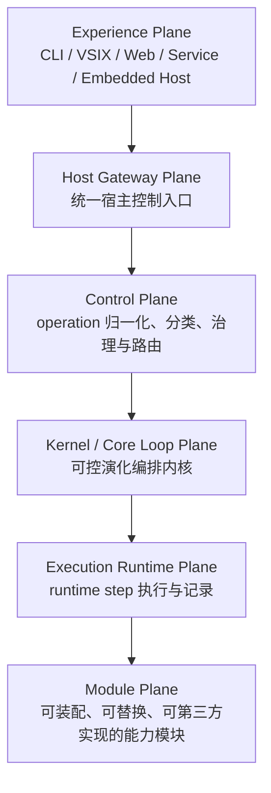

# 天枢 / TianShu 总体架构规范

## 1. 文档定位

本文是 TianShu 当前有效的总体架构验收基线，只记录已经确认并准备长期保留的设计约束。

本文不记录讨论过程、历史迁移、旧方案、临时实现细节或实施进度。任何代码、测试、配置、协议、模块或文档实现都必须与本文的边界定义对齐；若实现与本文冲突，必须先确认新的稳定结论，再更新本文。

实施状态只记录在 `docs/tianshu-implementation-tracker.md`。

Kernel / Core Loop Plane 的具体设计以 `docs/architecture/tianshu-kernel-core-loop-design.md` 为准；本文只保留顶层边界和跨层不变量。

各层级和模块的专项设计入口以 `docs/architecture/tianshu-planes-architecture.md` 为索引。专项文档不得弱化本文的六层职责和跨层不变量。

旧产品 turn loop 与新固定 StageGraph 路径的迁移对齐以 `docs/architecture/tianshu-old-new-loop-parity-design.md` 为准。36 起 CLI `send` 只能进入新 Kernel→Runtime loop；旧 `TianShu.AppHost.Tools.Runtime` turn loop 仅作为历史实现与迁移参考保留，不再是可选择的产品 turn 路径或 fallback。

## 2. 产品入口

正式产品品牌为“天枢 / TianShu”。面向用户、宿主和运行时的 source-of-truth 固定如下：

| 类型 | 正式入口 |
| --- | --- |
| 用户目录 | `~/.tianshu` |
| 主配置文件 | `tianshu.toml` |
| 环境变量 | `TIANSHU_*` |
| CLI | `tianshu` / `tianshu.exe` |
| RPC method 前缀 | `tianshu/` |
| 系统配置目录 | `/etc/tianshu` 或 `%PROGRAMDATA%\TianShu` |

运行时、CLI、ConfigGUI、协议层、模块加载和安装脚本只能把以上入口作为 TianShu 的正式配置与发布边界。第三方模型名、协议名或参考资料标题可以保留原名，但不能成为 TianShu 的产品入口或配置 source-of-truth。

## 3. 总体分层

TianShu 的正式架构采用六层主链：

```text
Experience Plane
  -> Host Gateway Plane
    -> Control Plane
      -> Kernel / Core Loop Plane
        -> Execution Runtime Plane
          -> Module Plane
```



Contracts / Abstractions 不作为独立运行层，而是各层之间的 typed boundary。跨层交互必须优先通过类型化契约表达；raw JSON、字符串命令和厂商 wire payload 只允许停留在模块实现、诊断记录或协议边界内。

## 4. 六层职责

| 层级 | 实际用途 | 不得越界 |
| --- | --- | --- |
| Experience Plane | 用户真正接触 TianShu 的入口，负责 CLI、VSIX、Web、Service、嵌入式宿主等交互体验。 | 不直接拼 provider 请求，不直接执行工具，不直接写 session/state，不定义核心编排。 |
| Host Gateway Plane | 面向不同消费宿主提供统一、稳定、类型化的控制入口。 | 不承载核心编排，不绕过 Control Plane，不绑定具体 UI 行为，不直接调用模块私有实现。 |
| Control Plane | 将用户操作 / 系统操作归一化为受治理、可追踪的 operation 类别，并路由到查询、控制、状态、治理或核心执行入口。 | 不编排 turn/stage，不决定模型调用步骤，不执行工具，不处理 provider wire protocol。 |
| Kernel / Core Loop Plane | TianShu 的核心智能内核，负责编排 turn、stage、context、route、checkpoint、recovery 和可控演化策略。 | 不依赖宿主实现，不直接执行外部副作用，不绕过 Stable Kernel Core 校验，不直接调用模块私有实现。 |
| Execution Runtime Plane | 执行 Kernel 产出的 runtime step，负责 provider call、tool dispatch、stream processing、state commit、artifact publish、diagnostics emit。 | 不自行规划核心任务，不改变治理边界，不决定长期策略晋升，不把执行细节上泄给宿主。 |
| Module Plane | 承载可装配、可替换、可第三方实现的能力模块，包括 provider、tools、memory、artifact、diagnostics、state、environment、MCP 等。 | 不反向依赖上层具体实现，不自行定义核心编排，不绕过模块声明的权限、副作用和审计契约。 |

三条核心边界必须保持稳定：

```text
Control Plane = operation normalization + governance + routing
Kernel = intent orchestration + stage planning + controlled evolution
Execution Runtime = step execution + event/result materialization
```

## 5. 请求生命周期

一次用户输入或系统操作的标准路径如下：

```text
1. Experience Plane 捕获用户操作或宿主操作。
2. Host Gateway Plane 将宿主输入转换为统一 typed host operation。
3. Control Plane 归一化 operation，应用 session/thread/workflow/governance 约束。
4. 若 operation 是查询、目录、诊断、投影或状态控制，Control Plane 直接返回对应 typed result。
5. 若 operation 需要核心执行，Control Plane 生成受治理的 core intent。
6. Kernel / Core Loop Plane 接收 core intent，编排 StageGraph、上下文、模型路由、工具策略、checkpoint 和恢复策略。
7. Execution Runtime Plane 执行 Kernel 批准的 runtime step。
8. Module Plane 提供具体能力实现。
9. Execution Runtime 生成 result、event、trace、state record、artifact record 和 diagnostics record。
10. Host Gateway 将可消费投影返回给 Experience Plane。
```

Control Plane 分流 operation，Kernel 编排 intent，Execution Runtime 执行 step。任何层不得把后两层职责提前到前一层。

## 6. 可控演化内核

Kernel / Core Loop Plane 由两个子层构成：

```text
Kernel / Core Loop Plane
  - Stable Kernel Core
  - Adaptive Orchestration Layer
```

| 子层 | 职责 | AI 权限 |
| --- | --- | --- |
| Stable Kernel Core | 提供不可绕过的边界、状态机、不变量、权限检查、审计、checkpoint、rollback、StageGraph 解释器和验证器。 | AI 不得直接修改或绕过。 |
| Adaptive Orchestration Layer | 由 AI 参与生成、选择、修正和评估 stage、stage graph、模型路由、工具策略、上下文策略、恢复策略和 checkpoint 策略。 | AI 可以在 Stable Kernel Core 的约束内提出和修正编排方案。 |

TianShu 的内核是可控演化系统：AI 可以演化编排资产，但不能直接演化稳定内核边界。

允许演化的对象包括：

- Stage 定义。
- StageGraph。
- 模型路由策略。
- 工具选择策略。
- 上下文策略。
- 失败恢复策略。
- checkpoint 策略。
- 多 agent 分工策略。
- 任务评估策略。

不得自动演化的对象包括：

- Stable Kernel Core 本身。
- 权限与治理边界。
- 状态机不变量。
- 审计与追踪要求。
- 模块加载信任边界。
- 未经人工确认的高风险持久化策略。

## 7. StageGraph IR

AI 不得只用自然语言 plan 影响内核。Adaptive Orchestration Layer 生成或修正的编排方案必须物化为可验证的 StageGraph IR。

`StageGraph` 至少表达：

| 字段 | 语义 |
| --- | --- |
| `graphId` | 编排图标识。 |
| `version` | 编排图版本。 |
| `intentType` | 适用的核心意图类型。 |
| `stages` | Stage 定义集合。 |
| `edges` | Stage 之间的合法流转关系。 |
| `policies` | 权限、治理、资源、上下文和副作用策略。 |
| `budgets` | token、时间、成本、重试和工具调用预算。 |
| `allowedTools` | 允许使用的 KernelTool / CapabilityTool 集合。 |
| `checkpointRules` | checkpoint 创建、提交和恢复规则。 |
| `recoveryRules` | 失败、超时、中断、回滚和降级规则。 |
| `evaluationRules` | 运行后评估与策略晋升规则。 |

`Stage` 至少表达：

| 字段 | 语义 |
| --- | --- |
| `id` | Stage 标识。 |
| `kind` | Stage 类型。 |
| `objective` | Stage 目标。 |
| `inputContract` | 输入契约。 |
| `outputContract` | 输出契约。 |
| `allowedKernelTools` | 本 Stage 允许调用的内核工具。 |
| `allowedCapabilityTools` | 本 Stage 允许请求的能力工具。 |
| `sideEffectLevel` | 副作用等级。 |
| `budget` | 时间、token、成本、重试等预算。 |
| `successCriteria` | 成功判定。 |
| `failureHandler` | 失败处理入口。 |

Stable Kernel Core 必须先验证 StageGraph，再允许 Execution Runtime 执行其产出的 runtime step。

## 8. AI ToolUse 模型

AI 对 TianShu 内核和外部世界产生影响的唯一入口是 ToolUse。ToolUse 是调用外壳，背后语义必须分型。

```text
AI ToolUse
  -> Kernel ToolUse
      -> KernelOperation / KernelProposal
      -> Stable Kernel Core validate
      -> RuntimeStep / ExecutionPlan

  -> Capability ToolUse
      -> CapabilityCall
      -> Execution Runtime execute
      -> Module Plane respond
```

Kernel ToolUse 用于影响内核编排机制；Capability ToolUse 用于请求外部能力。两者都必须可声明、可授权、可实现、可追踪、可回放。

Kernel ToolUse 示例：

- `propose_stage`
- `compose_stage_graph`
- `revise_stage_graph`
- `select_model_route`
- `select_tool_strategy`
- `update_context_policy`
- `propose_checkpoint`
- `propose_recovery_plan`
- `evaluate_run`
- `promote_strategy`
- `rollback_strategy`
- `propose_kernel_policy_change`

Kernel ToolUse 不得直接生效，必须经过以下流程：

```text
propose -> validate -> approve -> materialize -> execute
```

Capability ToolUse 示例：

- provider call。
- shell。
- file read / write。
- search。
- apply patch。
- browser。
- memory query / write。
- artifact publish / attach。
- diagnostics emit。
- state commit。
- environment capability。
- MCP capability。

Capability ToolUse 只有在当前 StageGraph、governance envelope、tool permission 和 side effect policy 同时允许时，才能被 Execution Runtime 物化为 runtime step。`GovernanceEnvelope` 的正式契约归属 `src/Contracts/TianShu.Contracts.Kernel`；Control Plane 负责创建和归一化 envelope；Kernel validator 负责保证 StageGraph、KernelOperation 与 RuntimeStep 不超过 envelope；Execution Runtime 的 plan、step 和 bridge 入口必须复用 envelope 校验。Tool / Module descriptor 必须提供与 `GovernanceEnvelope` 对齐的判断入口，至少覆盖 allow-list、副作用上限和 human gate。

## 9. 统一 Tool 接口

所有 AI 可使用能力必须基于统一底层接口，并在语义层分型。

```text
ITianShuTool
  - IKernelTool
  - ICapabilityTool
  - ISystemTool
```

统一接口必须描述：

- tool id。
- tool name。
- description。
- input schema。
- output schema。
- tool kind。
- permission declaration。
- side effect declaration。
- budget declaration。
- audit metadata。
- invocation entry。
- result envelope。

分型语义如下：

| 类型 | 用途 | 输出 |
| --- | --- | --- |
| `IKernelTool` | AI 用来提出或修正内核编排。 | `KernelOperation` / `KernelProposal`。 |
| `ICapabilityTool` | AI 用来请求外部能力或模块能力。 | `CapabilityCall` / `RuntimeStepResult`。 |
| `ISystemTool` | 系统内部保留能力。 | internal typed result。 |

Registry、discovery、authorization、audit 和 diagnostics 层只认识统一 tool 描述；Kernel 和 Execution Runtime 必须按 tool kind 分派语义。

## 10. Execution Runtime

Execution Runtime 只执行 Stable Kernel Core 批准的 runtime step。runtime step 是进入执行流水线的唯一形式。

`RuntimeStep` 至少包含以下语义类别：

| 类型 | 用途 |
| --- | --- |
| `ModelInvocationStep` | 调用模型 provider。 |
| `ToolInvocationStep` | 调用 CapabilityTool。 |
| `StateCommitStep` | 提交受控状态记录。 |
| `ArtifactStep` | 发布、附加、晋升或投影 artifact。 |
| `DiagnosticStep` | 记录诊断事件。 |
| `HostInteractionStep` | 请求用户输入、暂停、恢复或中断。 |
| `ModuleCapabilityStep` | 调用非工具形态的模块能力。 |

Execution Runtime 必须记录：

- execution id。
- plan id。
- kernel run id。
- step id。
- source StageGraph / Stage / KernelOperation。
- applied policy envelope。
- tool / module id。
- side effect metadata。
- result。
- error。
- cost / latency / token usage。
- trace / replay reference。

Execution Runtime 不得自行生成未经过 Kernel 批准的外部副作用步骤。

Kernel 到 Execution Runtime 的正式 live execution 组合入口归属 `src/Core/TianShu.RuntimeComposition`。Stable Kernel Core 只产出并验证 `ExecutionPlan`，不得直接依赖 runtime 实现；组合层负责把已批准 plan 交给 `IExecutionRuntime.ExecuteAsync`，并输出可审计 disposition。组合结果必须区分 approval-only、kernel rejected、runtime completed、runtime blocked 和 runtime failed；Kernel validation rejected 时不得调用 runtime，runtime blocked 时不得伪造成 Kernel completed。

产品入口若需要触发新 turn loop，必须通过 RuntimeComposition 或 Host Gateway 暴露的 typed bridge 进入，不得在 Experience Plane 直接构造 `CoreIntent`、`StageGraph`、`RuntimeStep`、`StableKernelCore`、`AdaptiveRuntimeExecutionLoop` 或 `TianShuExecutionRuntime`。CLI 等宿主只允许传入产品侧请求参数，并消费 completed / failed 等终态投影、stage path、runtime trace、diagnostics ref 和 replay summary。

多宿主 Experience Plane 的正式收敛口径如下：`src/Presentations/TianShu.Cli` 已作为当前主产品入口通过 RuntimeComposition / Host Gateway typed surface 进入新 loop；`src/Presentations/TianShu.ConfigGui` 是配置编辑宿主，只允许消费 Configuration projection / preview / apply contract，不进入 turn runtime，也不得生成 Kernel / Runtime 输入；`src/Presentations/TianShu.VSSDK.Sidecar` 可以作为 VSIX 的进程内 composition bridge 持有 `IExecutionRuntime` 生命周期并包装 Control Plane / Host Gateway，但不得引用或构造 `CoreIntent`、`StageGraph`、`RuntimeStep`、`StableKernelCore`、`AdaptiveRuntimeExecutionLoop`、`KernelRuntimeProductTerminalProjection` 等内部对象；`src/Presentations/TianShu.VSSDK.VSExtension` 只能通过 sidecar typed protocol 发送宿主操作、响应审批/输入并消费投影，不得引用 HostGateway、ControlPlane、RuntimeComposition 或 Execution.Runtime 项目。ConfigGUI 的 provider 连接探测若保留，只能作为配置诊断，不能成为模型路由或 runtime 执行决策。

默认 turn 执行路径的选择权归属 RuntimeComposition / Host Gateway typed decision 入口，不归属 CLI、VSIX、Web 等 Experience Plane。宿主只能提交产品侧请求参数、显式 opt-in/feature flag、宿主能力声明和已解析配置；typed decision 必须输出 `executionPath`、是否允许进入新 Kernel→Runtime loop、`fallbackReason`、`failureCode` 与可审计证据。36 起旧 AppHost loop 不再是 fallback；新 loop 不支持的能力必须 fail-closed，不得以“新 loop 不支持”为由静默落回旧 loop。默认 `send` 路径必须有测试覆盖无 opt-in 行为，证明其通过 typed decision 入口，而不是由 Experience Plane 直接选择或构造 Kernel / Runtime 内部对象。

CLI `send` 的默认路径从 23.4.1 起进入新 Kernel→Runtime loop，36 起显式旧入口 `--apphost-control-plane` 已移除并返回迁移诊断。`--kernel-runtime-loop` 仍可作为显式新 loop 验证入口保留，但不得改变默认路径语义；CLI summary 的 `executionPath` 必须固定为 `kernel-runtime-loop` 或 fail-closed，不得再出现旧 AppHost control-plane 证据。

Execution Runtime 的 provider/tool live 调用必须通过受控 bridge 与 binding registry 完成。`TianShuExecutionRuntime.ExecuteAsync(plan, context, ...)` 在存在已注册 provider/tool binding 时必须走对应 bridge；未注册 binding 的受控验收入口可以保留 synthetic approved-step 行为，但不得作为真实 provider/tool live evidence。Bridge 必须复用 RuntimeStep governance 校验，并把 `runId / executionId / planId / graphId / stageId / stepId` 写入 runtime metrics；bridge 输出也必须携带 `runtimePlanId / stepId / stepKind / sourceIntentId / sourceGraphId / sourceStageId / sourceKernelOperationId`，供 replay 从 runtime result 重建实际执行关系。Provider bridge 还必须把本次 provider request 的工具面以只含工具名的 `ProviderToolSurfaceEvent` 投影到 `runtimeDiagnosticsProjection.providerToolSurface`；该证据不得包含完整请求体、用户消息正文、API key 或 secret。

CLI 新 turn loop 的生产绑定归属 `src/Core/TianShu.RuntimeComposition`。`KernelRuntimeTurnLoopBridge` 只能接收产品侧请求参数和 resolved config，并通过 `KernelRuntimeTurnLoopComposition` 注册 `provider.default` 与默认只读工具集合。`ConfiguredResponsesProviderModule` 必须使用 `ResolvedTianShuConfig` 里的 provider/model/baseUrl/apiKeyEnv/wireApi 组装 provider southbound request；缺 model、provider、baseUrl、apiKeyEnv 或 API key 时必须 fail-closed。Provider module 的 secret 读取必须通过可注入 environment reader 完成，测试不得修改进程级常用 API key 环境变量。当前默认工具集合只包含 `read_file`、`list_dir`、`grep`、`glob`；`write` 只能在 CLI 显式审批态（例如默认新 loop 或 `--kernel-runtime-loop` 下传入 `--approve-all`，且审批决策为批准类）下从 `TianShu.Tools.FileSystemMutating` 注册，并且治理信封必须同时具备 `RequiresHumanGate=true`、审批引用、`AllowedToolIds` 包含 `write`、副作用上限不低于 `WorkspaceWrite`。模型自主 sub-agent 只在治理信封同时授予 `spawn_agent` 与 `module.sub_agent` 时开放，并由 RuntimeComposition 物化为 `ModuleCapabilityStep(module.sub_agent / sub_agent.spawn)`；默认未授予时仍 fail-closed。CLI 对真实 provider 暴露该能力时必须显式使用 `send --kernel-runtime-loop --enable-subagents --approve-all`，缺少 `--approve-all` 必须 fail-closed。CLI 新 loop 的 `write.path` 必须是 workspace-relative path，绝对路径即使落在 workspace 内也应 fail-closed；`apply_patch` 虽存在于 mutating filesystem 模块，但不得在本轮 CLI bridge 默认治理或 P23-E workspace write 验收中开放。shell、MCP、agent job、artifact 等更高风险工具同样不得在本轮 CLI bridge 默认治理中开放。

Provider-directed tool parity 的正式矩阵归属 `docs/architecture/tianshu-old-new-loop-parity-design.md`。当前 CLI 新 Kernel→Runtime loop 只把只读 filesystem 工具、显式审批态 `write`、以及受治理显式授予的 `spawn_agent` 作为模型可调用能力；`spawn_agent` 不是普通工具执行，而是 `ModuleCapabilityStep` 化的 sub-agent module 能力。`apply_patch`、shell、MCP tool/resource、artifact、memory/search tool、agent job 即使已有模块或旧路径实现，也不得隐式进入 provider tool surface。被模型幻觉请求的未开放工具必须 fail-closed，并投影结构化 failure code；已进入工具桥或 module bridge 的调用必须输出结构化 `toolResults[]`，工具级状态限定为 `succeeded`、`failed`、`blocked`、`cancelled`、`approval-required`、`timeout`。

34 起，review / plan UI 与 agent jobs 的产品归属固定如下：review / plan UI 是 Host Gateway / ControlPlane typed projection 与 runtime surface，不是模型可调用工具；CLI/Sidecar 可以消费 `PlanUpdated`、workflow plan projection、review start、diff artifact、approval / user input projection 等宿主事件，但旧 AppHost 私有 agent-message start/stream/complete 字段不作为新产品契约逐字段迁移。agent jobs 只作为人工/宿主管理 runtime surface 保留，例如 agent roster、agent thread register、job create / dispatch / report / read，不进入默认 provider tool allow-list。模型可请求的 sub-agent 属于独立的受治理能力：`spawn_agent` 只表达模型可见请求入口，真正执行由 `module.sub_agent / sub_agent.spawn` 承担；必须满足 descriptor、governance、human gate、execution bridge、projection、final acceptance 证据和成本/安全边界，不能复用旧 AppHost 工具存在这一事实直接放行。最终验收必须区分机制门禁与 live 自主触发观察矩阵：机制门禁证明通道可用；live 的 provider tool surface 证据以 `runtimeDiagnosticsProjection.providerToolSurface.hasSpawnAgent` 为准；live 行为观察必须预先冻结任务、模型协议 cell 和每格轮数，报告 `spawnObserved/total` 及各 cell 触发率，不得早停、追加/删除样本或按结果改写 N；live 未观察到自主 `spawn_agent` 是有效观察结论，但不能宣称产品级模型自主 Sub-Agent 已通过；提示词含方法诱导、矩阵未完整执行或无法确认 provider tool surface 时，live 观察证据无效。当前阶段的正式收口结论是：Sub-Agent 机制门禁通过，OpenAI Responses / Anthropic Messages / OpenAI Chat Completions 三协议 live 链路 turn 完成 `27/27`，provider tool surface 暴露 `spawn_agent` `27/27`，模型自主触发 `SPAWN_OBSERVED=0/27`。这表示机制完整且工具面就绪，但当前不宣称产品级模型自主多 Agent 已通过。

Provider southbound HTTP/SSE transport 必须携带可二次审查的 trace 与 turn metadata。`ProviderResponsesTransportHttpRequestContext` / `ProviderResponsesTransportWebSocketConnectContext` 提供可选 `TraceParent`；OpenAI Responses、OpenAI-compatible Chat Completions、Anthropic Messages、Google Generative HTTP binding 在收到 `TraceParent` 时必须透传 `traceparent` header。RuntimeComposition 的 `ConfiguredResponsesProviderModule` 必须从 `ExecutionId`、`RuntimeStepId`、thread/turn 标识生成 W3C `traceparent`，并通过 `x-codex-turn-metadata` 携带 executionId、threadId、turnId、runtimeStepId、sourceGraphId、sourceStageId；该 header 不得包含 API key 或 secret。

Provider tool continuation 的 canonical 输入必须同时保留“模型请求过的工具调用”和“工具执行结果”。`ToolCallProviderInputItem` 表示上一轮模型 tool/function call，`ToolResultProviderInputItem` 表示该 callId 的工具结果；RuntimeComposition 在 `tool-exec -> model-reason` 回边必须成对注入两类输入。Responses wire-api 投影为 `function_call` + `function_call_output`；OpenAI-compatible Chat Completions 投影为 assistant `tool_calls[]` + `tool` message。Chat SSE 的 tool call delta 可能分片到多个事件，provider module 必须在 `finish_reason` 到达时合并 call id、function name 与 arguments，再生成稳定的 `toolRequests[]`。

Provider southbound event projection 必须区分 assistant text 与 reasoning text。OpenAI-compatible Chat Completions SSE 的 `choices[].delta.content` 可以投影为 `ProviderTextDeltaEvent`；Anthropic Messages SSE 的 `content_block_delta.delta.text` 必须投影为 assistant text；`choices[].delta.reasoning_content` / `reasoning` 不得混入 assistant `resultText` 或 `assistantText`，只能进入 reasoning/diagnostic 类证据，或在没有专用投影前忽略。该规则用于保持新 Kernel→Runtime loop 与旧 AppHost 产品输出一致。

Provider component resolver 不得依赖一次性静态快照决定某个 wire API 是否具备 request composer、transport binding、retry strategy 或 tool surface builder。`ProviderResponsesComponentBootstraps` 可以缓存已发现 bootstrap，但 `Resolve` 在 miss 时必须 reload 一次；各 component resolver 应按需从 bootstrap 创建组件，避免 provider assembly 加载顺序导致 request composer 与 tool surface builder 可见性不一致。

新 Kernel→Runtime loop 的生产资源生命周期必须可释放且可复用。`KernelRuntimeTurnLoopComposition` 默认复用 provider HTTP client，不得在未来默认路径中按 turn 无界创建短生命周期 `HttpClient`；测试可通过 handler 或 client 注入隔离 transport。`KernelRuntimeTurnLoopBridge` 创建的 runtime 必须在 turn 结束后释放；`TianShuExecutionRuntime` 释放时必须释放 step binding registry 中实现 `IDisposable` / `IAsyncDisposable` 的 provider/tool binding，避免 provider module 资源悬空。

默认 turn graph 的 capability tool allow-list 必须按 `CoreIntent.Governance.AllowedToolIds` 收窄。若当前治理只允许只读工具，`stage.tool-exec` 的 stage side effect 应投影为 `ReadOnly`；只有引入 workspace write 或更高风险工具并具备 human gate / explicit approval 边界后，才允许相应提升。`ExecutionRuntimeToolBridge` 除校验 `RuntimeStep` 外，还必须用真实 `ToolDescriptor.IsAllowedBy(GovernanceEnvelope)` 二次校验 tool allow-list、副作用上限和 human gate，防止 step 自称低风险而绕过模块声明。

反应式执行的 replay 以实际 `RuntimeResult.StepResults` 为准。固定 `RunAsync` 仍要求静态 plan step 与 runtime result 一一匹配；`RunReactiveAsync` 中由模型 `toolRequests[]` 动态物化的工具 step 不要求预先存在于静态 plan 骨架，但必须携带 Kernel 来源标识、trace ref、diagnostics ref 和 metrics 归因。

指标源必须分离：候选生成统计归因到 `taskId / candidateKind / attemptIndex / reviseRound`，用于 C 阶段 graph/patch 候选诊断；Runtime 执行统计归因到 `runId / executionId / planId / graphId / stageId / stepId`，用于 fixed graph live execution 和后续 D evaluation。`estimated=true` 的文本长度 token 只能作为诊断值，不得计入真实 provider usage 或 strategy promotion 成本；cost 只有在 `estimated=false` 的 provider usage 与 price model 同时存在时才可用。

CLI 新 turn loop 的 P23-J 产品投影必须由 `KernelRuntimeTurnLoopBridge` 收集 `RuntimeMetricsEvent` 后生成，不允许 CLI 自行解析 runtime 内部 step。`KernelRuntimeDiagnosticsProjection` 至少包含 runtime trace refs、diagnostics refs、metrics event ids、model/tool metrics event count、provider usage token 汇总、cost availability、missing reasons 与 failure codes；`KernelRuntimeReplaySummary` 必须使用同一批 metrics events 构建，保证 replay step 的 `MetricsEventIds` 与产品投影一致。23.6 起，CLI 产品桥的终态必须统一来自 `KernelRuntimeProductTerminalProjection`，至少包含 session/thread/turn 稳定标识、turn status、assistant text、result text、thread projection、turn log projection、rollout record projection、runtime trace refs、diagnostics refs、replay completeness 和结构化 downgrade reasons。新 Kernel→Runtime loop 在存在 working directory 时必须写入自身的最小 turn log / rollout JSONL 证据，并把引用投影到 `TurnLog.Reference` 与 `RolloutRecord.Reference`；缺少可写工作目录或证据写入失败时必须投影 `{ available=false, reason=... }`，不得静默缺失字段。

HostGateway 的正式 thread/status 消费面归属 `src/Contracts/TianShu.Contracts.Projections.ThreadProjection`，不得直接暴露 RuntimeComposition 内部的 `KernelRuntimeProductTerminalProjection`。`ThreadProjection` 可以携带 `RuntimeStatus`、`TokenUsage`、`Diagnostics` 与 `Evidence` 附属投影：`RuntimeStatus` 表达 lifecycle、turn/background status、active run 和 notification code；`TokenUsage` 区分真实 provider usage 与 estimated usage 并保留 source；`Diagnostics` 聚合 runtime trace refs、diagnostics refs、metrics event ids、failure codes、missing reasons 与 context slicing summary；`Evidence` 承载 turn log、rollout、audit refs 和 downgrade reasons。Execution Runtime 维护 thread snapshot 时只从正式 stream event 和 typed payload 投影这些字段，不向 HostGateway 泄漏 raw provider diagnostics、secret、`RuntimeStep` 或 `StageGraph`。

旧/新产品行为 parity 必须保持严格验收口径。25.4.3f 已在同一显式 openai-compatible provider 配置、同一输入下，用当前源码 `dotnet run --project src/Presentations/TianShu.Cli/TianShu.Cli.csproj` 验证旧 AppHost 显式路径与新 Kernel→Runtime 默认路径的用户可见终态等价：两边均 `exitCode=0`、`turnStatus=completed`、`resultText=OK`。28 已补最小多 provider live matrix：当前源码、隔离 `TIANSHU_HOME`、无显式 `--config` 下，`responses` wire-api（`openai/gpt-5.5`，当前配置 endpoint）与 `openai_chat_completions` wire-api（`openai-compatible/openai-compatible-default`）均完成真实 live turn，且错误配置 fail-closed 不回落 fake/registered provider。30A 已补 `anthropic_messages` transport / provider bridge parity；当前默认安装模块必须覆盖除 Google 以外的三条 live 协议路径：`openai/gpt-5.5/openai_responses`、`anthropic/claude-opus-4.8/anthropic_messages`、`openai-compatible/openai-compatible-default/openai_chat_completions`。Google 由于当前模型稳定性不足不进入默认 live 阻塞矩阵，但 Provider adapter 仍可作为模块存在。29 已补 CLI 产品命令层 Host control parity：`follow-up --kernel-runtime-loop` 可执行 interrupt、steer、resume，并分别证明 file-backed cancel signal、provider input steer evidence、checkpoint store + pending steer queue 重入。上述证据仍不等同 provider WebSocket parity、完整旧 transport retry/idle timeout/W3C trace parity、非 CLI 宿主控制面 parity 或旧 AppHost 兼容路径完全删除。本地核心架构守护以 `tools/Run-TianShuCoreArchitectureChecks.ps1` 为入口，只验证当前源码测试矩阵，不打包、不安装、不调用用户级 `tianshu.exe`。

CLI 新 turn loop 的 `ModelInvocationStep` 输入必须包含产品用户输入；follow-up / steer 输入若被 Host operation 接受，必须作为结构化 provider input 注入下一轮 `model-reason`，并在终态投影中记录 applied / queued / unavailable / reason。23.7~23.9 的 interrupt、resume、steer 控制面必须通过 RuntimeComposition typed bridge 进入 `CoreIntent -> StageGraph -> HostInteractionStep/ModelInvocationStep`，并产出可审计 product projection；checkpoint lookup 必须命中 RuntimeComposition HostControl checkpoint store，缺失或 thread mismatch 必须 fail-closed，不得隐式回退旧 AppHost loop。interrupt 已接入新 Kernel→Runtime loop 的 in-process active-run cancellation registry 和 workingDirectory file-backed active-run index / cancel signal：`RunAsync` 登记 active run，`RunInterruptAsync` 按 thread/turn 定位并取消匹配中的 run；命中时终态投影 `ActiveRunCancellation.Available=true` 并引用 `active-run://...`，未命中时结构化返回 `active_run_not_found`。因此 interrupt 的固定图 stage side effect 与 RuntimeComposition bridge governance 必须声明 `HostMutation`；resume 通过 checkpoint store 和 `HostInteractionStep(resume.from_checkpoint)` 重入，当前仍保持 `ReadOnly`，直到真实 host state mutation 或 pending response flush 接入。

29 起，Host control parity 的正式归属固定为 `Host Gateway typed surface -> Control Plane normalized operation -> RuntimeComposition HostControl bridge/store -> CoreIntent -> StageGraph -> RuntimeStep -> Execution Runtime projection`。跨进程 active-run registry、checkpoint store 与 pending steer queue 不属于 CLI、ConfigGUI、VSExtension 或 HostGateway 私有状态；它们必须由 `src/Core/TianShu.RuntimeComposition` 提供可注入 HostControl store 抽象与默认实现。HostGateway 只能暴露 typed operation 和 projection，Control Plane 只做操作归一化与治理转发，Execution Runtime 只消费 RuntimeStep 并产出 metrics / diagnostics / evidence。CLI 和其他宿主不得直接访问 HostControl store、`CoreIntent`、`StageGraph`、`RuntimeStep`、`StableKernelCore` 或 `AdaptiveRuntimeExecutionLoop`。29 已在 RuntimeComposition 内补 workingDirectory file-backed active-run index / cancel signal、terminal checkpoint store、pending steer queue、resume pending steer 重入和 run 生命周期清理；CLI `follow-up --kernel-runtime-loop` 产品命令层已补 interrupt / steer / resume 入口：interrupt 写入 cancel signal 并投影 `active-run://...`，steer 进入下一轮 `model-reason` provider input 并投影 `applied_to_model_input`，resume 解析 checkpoint store 并消费同 thread pending steer queue。该实现只关闭当前 CLI 产品控制面 Host control parity，不等同 ConfigGUI / Sidecar / VSExtension parity、provider streaming parity 或旧 AppHost 兼容路径删除。

Context Policy 的正式契约归属 `src/Contracts/TianShu.Contracts.Kernel`。Kernel 在 StageGraph / Stage 边界决定 `ContextPolicy`，并在批准后形成 `ApprovedContextPolicy`；Execution Runtime 通过 `ExecutionRuntimeContextPolicyBridge` 将 `ContextSourceCandidate` 物化为 provider-neutral `ProviderInputItem` 与 `ContextPolicyApplicationReport`。当前用户输入和最新纠正优先级最高；工具证据和 artifact 引用必须有可追踪 ref；低置信历史默认降权为 `ReferenceOnly`；超预算或缺失证据引用必须进入 dropped reason。Provider Module 不得重新裁切上下文，只能消费 Execution Runtime 已准备好的 `ProviderInvocationRequest.Inputs`。

Context slicing diagnostics 的产品投影不要求复制旧 AppHost raw event 结构。`ContextPolicyApplicationReport` 是 Runtime/diagnostics 内部的事实报告；Host projection 使用 `ThreadContextSlicingDiagnosticsProjection` 投影 policy id、预算、estimated input / included tokens、kept/dropped segment、source kind、projection mode、dropped reason、evidence ref、artifact ref 与 source layer。缺 evidence、预算超限、source mismatch 或 fail-closed 都必须结构化记录；Provider Module 不得用自己的策略重算或覆盖这些裁切结果。

Model Route 的正式契约归属 `src/Contracts/TianShu.Contracts.Kernel`。Kernel 在 StageGraph / Stage 边界决定 `ModelRoutePolicy`，并在批准后形成 `ApprovedModelRoutePolicy`；Execution Runtime 通过 `ExecutionRuntimeModelRouteBridge` 将已批准候选物化为 `ModelInvocationStep` 与 `ModelRoutePolicyApplicationReport`。缺失 route candidate、不可用 candidate 或 preferred candidate 不一致必须 fail closed；route diagnostics 只允许暴露 provider、model、protocol、candidate index、endpoint ref 和 diagnostics correlation id 等安全引用，不得暴露 secret 明文。Provider Module 只消费已解析 `ProviderInvocationRequest`，不得自行选择 route strategy、provider、model 或 fallback candidate。

## 11. Module Plane

Module 是 TianShu 可装配、可替换、可第三方实现的能力单元。

Module 家族包括：

- Provider Module。
- Tool Module。
- Memory Module。
- Identity Module。
- Artifact Module。
- State Module。
- Diagnostics Module。
- Environment Module。
- MCP Module。
- Evaluation Module。
- SubAgent Orchestration Module。

Module 必须通过 contracts / abstractions 暴露能力，并声明：

- module id。
- capability set。
- configuration schema。
- required permissions。
- side effect profile。
- trust level。
- diagnostics surface。
- health / smoke check。
- version。

通用 Module Plane 契约归属 `src/Contracts/TianShu.Contracts.Modules`。Provider、Tool、Memory、Artifact、Diagnostics、Workspace / Environment、Configuration 等模块家族必须能投影为 `ModuleDescriptor`，并通过 `ModuleCapabilityDescriptor`、`ModuleTrustLevel`、`ModuleHealthProbe` 与 `IModuleHealthCheck` 进入 discovery、治理、健康检查和验收链路。

Memory / Identity Module 的正式能力入口归属 `src/Contracts/TianShu.Contracts.Memory`。`IMemoryModule` 是 Execution Runtime 通过 `ModuleCapabilityStep` 调用 Memory query / mutation 的统一 surface；实现层由 `src/Core/TianShu.IdentityMemory` 通过 `MemoryServiceModuleAdapter` 包裹当前 `IMemoryService`，并以 `BuiltInModuleDescriptors.MemoryIdentity` 声明模块身份。Memory query 只返回 provider、space、overlay、record、review、export 等 typed projection；Memory mutation 必须携带 RuntimeStep 来源、Kernel operation 来源、permission、side effect 与 `MemoryOperationContext`。

Memory / Identity Module 不拥有 Kernel 编排权，不选择模型路由，不生成 StageGraph，不裁切上下文策略。`AddMemory` 只表达新增事实，正式纠错必须使用 `SupersedeMemory` 并保留 supersede link；`ForgetMemory`、`DeleteMemory`、`SupersedeMemory` 必须由 provider / store 写入 audit record。Memory Module 不得保存完整模型思考链或内部推理轨迹，只允许保存用户确认事实、工具证据、artifact 引用、反馈、引用记录和可审计摘要。

Artifact / State / Projection Module 的正式能力入口归属 `src/Contracts/TianShu.Contracts.Projections`。`IArtifactStateProjectionModule` 是 Execution Runtime 通过 `ArtifactStep` 调用 artifact publish / promote / attach，并通过 `ModuleCapabilityStep` 查询 projection snapshot 的统一 surface；实现层由 `src/Core/TianShu.ArtifactStore` 的 `ArtifactStateProjectionModuleAdapter` 包裹 `IArtifactStore`、`IProjectionSnapshotSource` 与 `IProjectionRuntimeStores`。Projection query 只能返回 `ProjectionSnapshotView` 等 contract-level view，不得向上暴露 `ProjectionSnapshotRecord` 作为正式对外结果。

Checkpoint materialization 必须同时关联 `KernelRunId`、`StageGraphId`、`StageId`、`ExecutionId` 与 `ExecutionTraceId`。`src/Hosting/TianShu.AppHost.State` 只保留宿主状态持久化与映射，不拥有 Kernel state machine、StageGraph interpreter 或 Kernel validator 语义。

Diagnostics / Trace Module 的正式能力入口归属 `src/Contracts/TianShu.Contracts.Diagnostics`。`IDiagnosticsModule` 是 Execution Runtime 通过 `DiagnosticStep` 记录 Kernel trace、Execution Runtime step、Module call 与 validation rejection 的统一 surface；实现层由 `src/Core/TianShu.Diagnostics` 的 `DiagnosticsModuleAdapter` 包裹 `IDiagnosticEventSink`、`IDiagnosticRedactor` 与采集策略，并以 `BuiltInModuleDescriptors.Diagnostics` 声明模块身份。

Diagnostics Module 不拥有编排权，不生成 RuntimeStep，不决定路由、上下文策略或治理策略。`ExecutionRuntimeDiagnosticsModuleBridge` 必须校验 module kind、`DiagnosticStep.DiagnosticKind` 与 `DiagnosticsModuleEventKind`，并要求 RuntimeStep / Module call 事件携带匹配的 `RuntimeStepId`。默认诊断输出必须先脱敏 secret、API key、raw header 和完整敏感路径，再写入 sink 或暴露给 Host Gateway。

Workspace / Environment Module 的正式能力入口归属 `src/Contracts/TianShu.Contracts.Environment`。`IWorkspaceModule` 是 Execution Runtime 通过 `ModuleCapabilityStep` 只读调用 workspace resolver 的统一 surface；实现层由 `src/Core/TianShu.RuntimeComposition` 的 `BuiltInWorkspaceEnvironmentModule` 消费 `WorkspaceResolverEffectivePolicy` 并输出 `WorkspaceFact`、`WorkspaceFactSource`、diagnostics refs 与 issue code。`ExecutionRuntimeWorkspaceModuleBridge` 必须校验 RuntimeStep governance、module kind、module id、descriptor allow-list 与只读副作用。Workspace facts 可投影为 `ContextSourceKind.WorkspaceFact`，进入 ContextPolicy 和 diagnostics；resolver 不得输出 Kernel decision，不得执行 shell 或文件写入。

Module 不得反向依赖 Experience、Host Gateway、Control Plane、Kernel 或 Execution Runtime 的具体实现。模块内部可以使用任意实现手段连接外部系统，但对上层只能暴露正式模块契约。

## 12. 演化闭环

Adaptive Orchestration Layer 的纠错性来自可观测、可回放、可评估、可晋升和可回滚。

一次策略演化流程如下：

```text
draft
  -> validated
  -> trial
  -> promoted
  -> deprecated / rolled_back
```

评估输入包括：

- expected outcome。
- actual outcome。
- tool result。
- provider result。
- error / timeout。
- test result。
- user correction。
- recovery success rate。
- cost / latency / token。
- rollback count。
- policy violation attempt。

晋升策略必须满足：

- 通过 Stable Kernel Core 验证。
- 无越权 capability request。
- 成本、耗时或成功率优于当前基线，或具备明确的任务适配价值。
- 有可回放 trace。
- 有可回滚版本。
- 高风险策略经过人工 gate。

长期保留的演化资产必须版本化，并能追溯到产生它的 run trace、评估结果和批准记录。

## 13. 验收不变量

以下约束作为后续实现、测试和审查的验收基线：

- Experience Plane 只能通过 Host Gateway 进入 TianShu。
- Host Gateway 是面向不同消费宿主的统一 typed control surface。
- Control Plane 只负责 operation 归一化、分类、治理与路由。
- Kernel / Core Loop Plane 承载编排器和自适应内核。
- Stable Kernel Core 不可由 AI 直接修改或绕过。
- Adaptive Orchestration Layer 只能演化可验证的编排资产。
- Execution Runtime 只执行 Kernel 批准的 runtime step。
- Module Plane 承载可替换能力模块。
- AI 对系统产生影响的唯一入口是 ToolUse。
- Kernel ToolUse 产出 KernelOperation / KernelProposal，必须经 Stable Kernel Core 校验。
- Capability ToolUse 必须经 Execution Runtime 调用 Module Plane。
- 所有 AI 可用 tool 必须基于统一 tool 接口并按语义分型。
- 所有外部副作用必须可授权、可审计、可追踪、可回放。
- 所有长期演化策略必须版本化、可评估、可晋升、可回滚。
